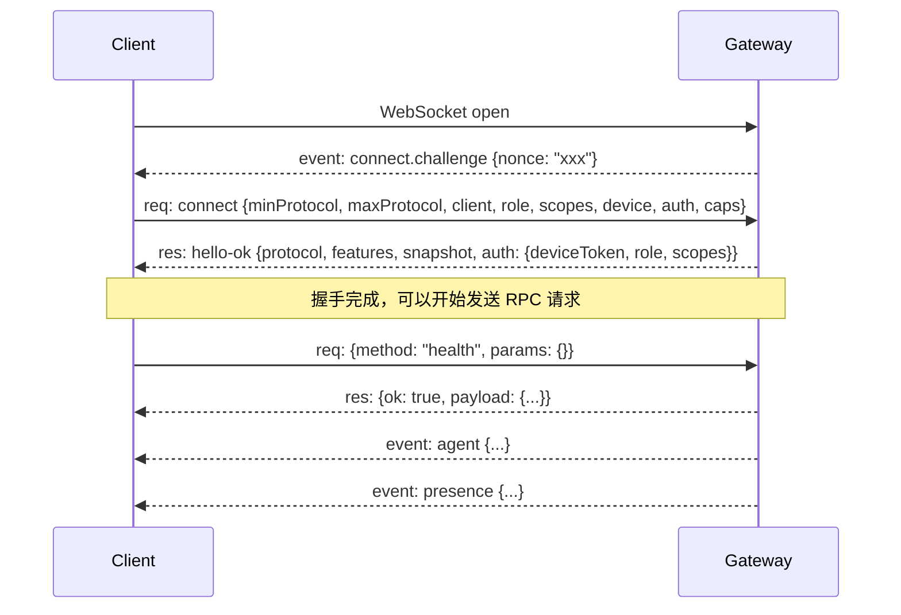

# Phase 1：Client 层源码深度解析

> 分析对象：OpenClaw 六层架构中的 **L1 Client 层**
> 分析目标：各客户端构建过程的异同 + 接入新客户端的二次开发指南

---

## 1. Client 层总览

Client 层是用户与 OpenClaw 交互的入口。所有 Client 都通过 **统一的 WebSocket JSON-RPC 协议** 连入 Gateway（默认 `ws://127.0.0.1:18789`）。

OpenClaw 仓库中存在 **四类 Client 实现**：

| Client 类型             | 语言/技术栈               | 核心 WS 客户端类                   | 代码位置                                                                   |
| ----------------------- | ------------------------- | ---------------------------------- | -------------------------------------------------------------------------- |
| **WebUI（Control UI）** | TypeScript + Lit 3 + Vite | `GatewayBrowserClient`             | `ui/src/ui/gateway.ts`                                                     |
| **CLI**                 | TypeScript + Node.js      | `GatewayClient`                    | `src/gateway/client.ts`                                                    |
| **外部 SDK**            | TypeScript + Node.js      | `OpenClaw`（封装 `GatewayClient`） | `packages/sdk/src/client.ts`                                               |
| **macOS / iOS**         | Swift + SwiftUI           | `GatewayChannel`                   | `apps/shared/OpenClawKit/Sources/OpenClawKit/GatewayChannel.swift`         |
| **Android**             | Kotlin + Jetpack Compose  | `GatewaySession`                   | `apps/android/app/src/main/java/ai/openclaw/app/gateway/GatewaySession.kt` |

---

## 2. 统一协议规范（所有 Client 共有）

### 2.1 WS 帧格式

所有 Client 必须遵守完全相同的 Wire Protocol：

**请求帧**：

```json
{
  "type": "req",
  "id": "<UUID>",
  "method": "<RPC 方法名>",
  "params": { ... }
}
```

**响应帧**：

```json
{
  "type": "res",
  "id": "<与请求对应的 UUID>",
  "ok": true,
  "payload": { ... }
}
```

**事件帧**（服务端推送）：

```json
{
  "type": "event",
  "event": "<事件名>",
  "payload": { ... },
  "seq": 42,
  "stateVersion": { "presence": 1, "health": 1 }
}
```

> 源码依据：`src/gateway/protocol/index.ts` 定义了 `RequestFrame`、`ResponseFrame`、`EventFrame` 的 TypeBox Schema，运行时通过 Ajv 校验。

### 2.2 连接握手流程

所有 Client 的连接握手遵循完全相同的 **三步流程**：

```
步骤 1：Client 打开 WebSocket 连接到 Gateway
步骤 2：Gateway 发送 connect.challenge 事件（包含 nonce）
步骤 3：Client 发送 connect 请求（包含签名、auth、协议版本等）
        → Gateway 返回 hello-ok 响应（包含 snapshot、features、auth 信息）
```



> 源码依据：
>
> - WebUI: `ui/src/ui/gateway.ts` 第 782-789 行 `handleMessage` 中处理 `connect.challenge`
> - CLI: `src/gateway/client.ts` 第 549 行 `sendConnect()` 方法
> - Android: `GatewaySession.kt` 中 `handleMessage` 处理 challenge
> - iOS/macOS: `GatewayChannel.swift` 中 `handleChallengeEvent` 处理 challenge

### 2.3 协议版本协商

所有 Client 必须在 `connect` 请求中声明支持的协议版本范围：

```json
{
  "minProtocol": 4,
  "maxProtocol": 4
}
```

当前协议版本定义：

| 语言       | 源文件                            | 值                                                                 |
| ---------- | --------------------------------- | ------------------------------------------------------------------ |
| TypeScript | `src/gateway/protocol/version.ts` | `PROTOCOL_VERSION = 4`, `MIN_CLIENT_PROTOCOL_VERSION = 4`          |
| Kotlin     | `GatewayProtocol.kt`              | `GATEWAY_PROTOCOL_VERSION = 4`, `GATEWAY_MIN_PROTOCOL_VERSION = 4` |
| Swift      | 通过 JSON Schema 生成的协议模型   | 与 TS 保持一致                                                     |

> **如果 Client 声明的版本范围与 Gateway 不兼容，Gateway 会返回 `PROTOCOL_MISMATCH` 错误并关闭连接。**

### 2.4 connect 请求参数结构

所有 Client 发送的 `connect` 请求具有统一的参数结构（`ConnectParams`）：

```typescript
type ConnectParams = {
  minProtocol: number; // 客户端支持的最低协议版本
  maxProtocol: number; // 客户端支持的最高协议版本
  client: {
    // 客户端身份标识
    id: GatewayClientId; // 如 "openclaw-control-ui", "cli", "openclaw-macos"
    version: string; // 客户端版本
    platform: string; // 运行平台
    mode: GatewayClientMode; // 如 "webchat", "cli", "ui", "node"
    instanceId?: string; // 实例 ID（可选）
    displayName?: string; // 显示名称（可选）
    deviceFamily?: string; // 设备系列（可选，如 "iPhone", "Mac"）
  };
  role: string; // 角色（通常 "operator" 或 "node"）
  scopes: string[]; // 权限范围
  device?: {
    // 设备身份签名（可选但推荐）
    id: string; // 设备 ID（公钥指纹）
    publicKey: string; // Ed25519 公钥（base64url）
    signature: string; // 签名（base64url）
    signedAt: number; // 签名时间戳
    nonce: string; // Gateway 提供的 nonce
  };
  caps: string[]; // 客户端能力声明
  auth?: {
    // 认证信息
    token?: string; // 共享令牌
    deviceToken?: string; // 设备令牌（配对后获得）
    password?: string; // 密码
  };
  userAgent?: string; // User-Agent
  locale?: string; // 语言区域
};
```

### 2.5 设备身份与签名机制

所有 Client 都实现了 **相同的 Ed25519 设备身份签名**：

1. **生成密钥对**：首次运行时生成 Ed25519 密钥对并持久化
2. **计算 deviceId**：`SHA-256(publicKey)` 的十六进制表示
3. **构建签名 payload**：`v3|deviceId|clientId|clientMode|role|scopes|signedAtMs|token|nonce|platform|deviceFamily`
4. **签名**：使用 Ed25519 私钥签名 payload

> **跨语言一致性保障**：签名 payload 的构建在 TS/Swift/Kotlin 三端保持完全一致的格式。源码中有注释 "Keep cross-runtime normalization deterministic (TS/Swift/Kotlin)"。

各端签名 payload 构建对比：

| 端             | 源文件                                                | 函数                                                                               |
| -------------- | ----------------------------------------------------- | ---------------------------------------------------------------------------------- |
| **TypeScript** | `src/gateway/device-auth.ts`                          | `buildDeviceAuthPayloadV3()`                                                       |
| **Swift**      | `apps/shared/OpenClawKit/.../DeviceAuthPayload.swift` | `GatewayDeviceAuthPayload.buildV3()`                                               |
| **Kotlin**     | `apps/android/.../DeviceAuthPayload.kt`               | `DeviceAuthPayload.buildV3()`                                                      |
| **WebUI**      | `ui/src/ui/gateway.ts`                                | `buildDeviceAuthPayload()`（使用 v2 格式，通过 `src/gateway/device-auth.js` 导入） |

---

## 3. 各 Client 实现的异同对比

### 3.1 总体对比表

| 维度             | WebUI                                           | CLI                       | 外部 SDK                        | macOS/iOS                         | Android                          |
| ---------------- | ----------------------------------------------- | ------------------------- | ------------------------------- | --------------------------------- | -------------------------------- |
| **语言**         | TypeScript (浏览器)                             | TypeScript (Node.js)      | TypeScript (Node.js)            | Swift                             | Kotlin                           |
| **WS 库**        | 浏览器原生 `WebSocket`                          | `ws` (npm)                | `ws`（通过 `GatewayClient`）    | `URLSessionWebSocketTask`         | OkHttp `WebSocket`               |
| **Client ID**    | `openclaw-control-ui`                           | `cli`                     | 可配置（默认 `gateway-client`） | `openclaw-macos` / `openclaw-ios` | `openclaw-android`               |
| **Client Mode**  | `webchat`                                       | `cli`                     | 可配置                          | `ui` / `node`                     | `node`                           |
| **默认 Role**    | `operator`                                      | `operator`                | 可配置                          | `operator` 或 `node`              | `node`                           |
| **默认 Scopes**  | `operator.{admin,read,write,approvals,pairing}` | 由配置决定                | 可配置                          | 按角色决定                        | 按角色决定                       |
| **设备身份**     | Ed25519 via `@noble/ed25519` (browser crypto)   | Ed25519 via Node `crypto` | 继承 `GatewayClient`            | Ed25519 via `CryptoKit`           | Ed25519 via `java.security`      |
| **密钥存储**     | `localStorage`                                  | `~/.openclaw/state/` 文件 | 继承 `GatewayClient`            | Keychain / 文件                   | 应用私有存储                     |
| **设备令牌存储** | `localStorage`                                  | 文件系统                  | 继承 `GatewayClient`            | Keychain / 文件                   | 应用私有存储                     |
| **自动重连**     | ✅ 指数退避（800ms → 15s）                      | ✅ 指数退避（1s 起）      | ✅（继承）                      | ✅                                | ✅                               |
| **TLS 指纹校验** | ❌ （浏览器限制）                               | ✅ 可选                   | ✅ 可选                         | ✅                                | ✅                               |
| **Node 能力**    | ❌                                              | ❌                        | ❌                              | ✅（camera/screen/canvas/...）    | ✅（camera/screen/location/...） |
| **事件订阅**     | `onEvent` 回调 + `addEventListener`             | `onEvent` 回调            | `AsyncIterable` 事件流          | delegate / callback               | callback                         |

### 3.2 WebUI Client 特有行为

**源文件**：`ui/src/ui/gateway.ts`（`GatewayBrowserClient` 类，920 行）

独特特征：

1. **直接 import 后端协议类型**：WebUI 编译时直接 `import` 后端 `src/gateway/protocol/*` 的 TS 类型，确保前后端协议帧定义同源，不存在类型漂移风险。

2. **浏览器安全上下文限制**：`crypto.subtle` 仅在 HTTPS/localhost 下可用。非安全上下文会跳过设备身份，退化为 token-only 认证。

3. **设备令牌存储在 localStorage**：密钥存 `openclaw-device-identity-v1`，令牌存 `openclaw-device-auth-v1`。

4. **connect.challenge 等待窗口**：WebSocket `open` 后等待 750ms 再发送 connect（给 Gateway 时间发送 challenge nonce）。

5. **无 TLS 指纹校验**：浏览器环境无法做自定义证书校验。

6. **Operator 全权限**：默认请求全部 operator scope（`admin/read/write/approvals/pairing`）。

```
关键代码路径：
ui/src/ui/gateway.ts          → GatewayBrowserClient 主类
ui/src/ui/device-identity.ts  → Ed25519 密钥生成与存储（@noble/ed25519）
ui/src/ui/device-auth.ts      → 设备令牌 localStorage 存取
ui/src/ui/app-gateway.ts      → 应用层 Gateway 连接管理
ui/src/ui/controllers/*.ts    → 各业务控制器（通过 GatewayBrowserClient.request 调用 RPC）
```

### 3.3 CLI Client 特有行为

**源文件**：`src/gateway/client.ts`（`GatewayClient` 类，1275 行）

独特特征：

1. **使用 `ws` npm 包**：Node.js 环境使用 `ws` 库（不是浏览器原生 WebSocket），支持 TLS 选项、自定义 headers 等。

2. **TLS 指纹校验**：支持 `tlsFingerprint` 选项，可以 pin 特定的 Gateway TLS 证书。

3. **更丰富的认证选项**：
   - `token`：共享令牌
   - `bootstrapToken`：引导令牌（初次设置用）
   - `deviceToken`：设备令牌
   - `password`：密码
   - `approvalRuntimeToken`：审批运行时令牌

4. **安全检查**：禁止向非 loopback 地址发起 `ws://`（明文）连接（CWE-319），除非显式设置 `OPENCLAW_ALLOW_INSECURE_PRIVATE_WS=1`。

5. **tick 心跳监控**：跟踪 Gateway 的 `tick` 事件，检测静默断连。

6. **签名 payload 使用 v3 格式**：包含 `platform` 和 `deviceFamily`，比 WebUI 的 v2 更完整。

7. **代理支持**：支持 HTTP/HTTPS 代理环境变量。

```
关键代码路径：
src/gateway/client.ts              → GatewayClient 主类
src/infra/device-identity.ts       → Ed25519 密钥生成与存储（Node crypto）
src/infra/device-auth-store.ts     → 设备令牌文件系统存储
src/gateway/device-auth.ts         → 签名 payload 构建
src/gateway/protocol/version.ts    → 协议版本常量
src/gateway/protocol/index.ts      → 协议帧校验
```

### 3.4 外部 SDK Client 特有行为

**源文件**：`packages/sdk/src/client.ts`（`OpenClaw` 类，855 行）

独特特征：

1. **高层封装**：SDK 不直接使用 `GatewayClient`，而是通过 `GatewayClientTransport` 适配层封装，提供面向领域的 API：
   - `oc.agents.*` — Agent 管理
   - `oc.sessions.*` — 会话管理
   - `oc.runs.*` — Run 管理
   - `oc.tasks.*` — 任务管理
   - `oc.models.*` — 模型列表
   - `oc.tools.*` — 工具调用
   - `oc.artifacts.*` — 产物管理
   - `oc.approvals.*` — 审批管理
   - `oc.environments.*` — 环境管理

2. **AsyncIterable 事件流**：事件以 `AsyncIterable` 方式消费，支持按 `runId` 过滤。

3. **事件标准化**：Gateway 原生事件（`agent`/`chat`/`presence`）被标准化为 SDK 事件类型（`assistant.delta`/`run.completed`/`tool.start`）。

4. **自动重连 + 事件重放**：断线重连后可以从 replay buffer 恢复事件。

```
关键代码路径：
packages/sdk/src/client.ts     → OpenClaw 主类 + 各命名空间
packages/sdk/src/transport.ts  → GatewayClientTransport（封装 GatewayClient）
packages/sdk/src/event-hub.ts  → EventHub 事件总线
packages/sdk/src/normalize.ts  → Gateway 事件 → SDK 标准事件的转换
packages/sdk/src/types.ts      → SDK 公共类型定义
```

使用示例：

```typescript
import { OpenClaw } from "@openclaw/sdk";

const oc = new OpenClaw({ url: "ws://127.0.0.1:18789", token: "your-token" });
await oc.connect();

const run = await oc.runs.create({ input: "你好", model: "deepseek/deepseek-v4-flash" });
for await (const event of run.events()) {
  if (event.type === "assistant.delta") {
    process.stdout.write(event.data.delta ?? "");
  }
}
await oc.close();
```

### 3.5 macOS / iOS Client 特有行为

**源文件**：`apps/shared/OpenClawKit/Sources/OpenClawKit/GatewayChannel.swift`（1140+ 行）

独特特征：

1. **Swift 原生实现**：使用 `URLSessionWebSocketTask` 进行 WS 通信，非第三方库。

2. **双角色**：macOS 既是 operator client 也可以是 node（提供 `camera.*`、`screen.record`、`canvas.*`、`location.get` 等设备命令）。

3. **CryptoKit Ed25519**：使用苹果原生 `CryptoKit.Curve25519` 实现设备身份签名。

4. **Keychain 存储**：密钥和令牌存储在 macOS/iOS Keychain 中，安全性高于文件系统。

5. **Bonjour 服务发现**：支持通过 mDNS/Bonjour 自动发现局域网内的 Gateway。

6. **TLS 指纹 pinning**：支持证书指纹校验。

7. **协议模型由 JSON Schema 生成**：TypeBox Schema → JSON Schema → Swift Codegen，保证类型一致。

```
关键代码路径：
apps/shared/OpenClawKit/Sources/OpenClawKit/
  ├── GatewayChannel.swift            → WS 客户端主类
  ├── GatewayConnectChallengeSupport.swift → challenge 握手
  ├── DeviceIdentity.swift            → Ed25519 密钥管理（CryptoKit）
  ├── DeviceAuthPayload.swift         → 签名 payload 构建（v3 格式）
  ├── DeviceAuthStore.swift           → 设备令牌 Keychain 存储
  ├── GatewayNodeSession.swift        → Node 角色会话
  ├── GatewayTLSPinning.swift         → TLS 证书 pinning
  ├── BonjourTypes.swift              → Bonjour 服务发现
  └── GatewayPayloadDecoding.swift    → 协议帧解码
```

### 3.6 Android Client 特有行为

**源文件**：`apps/android/app/src/main/java/ai/openclaw/app/gateway/GatewaySession.kt`（1277+ 行）

独特特征：

1. **OkHttp WebSocket**：使用 OkHttp 的 `WebSocket` + `WebSocketListener`。

2. **Kotlin 协程**：连接管理基于 `CoroutineScope`，请求使用 `CompletableDeferred` 实现异步。

3. **Node 角色优先**：Android 主要以 `role: node` 接入，提供 `camera.*`、`screen.record`、`location.get` 等设备命令。

4. **Java Security Ed25519**：使用 `java.security.KeyPairGenerator` 生成 Ed25519 密钥。

5. **应用私有存储**：密钥和令牌存储在 Android 应用的私有文件目录中。

6. **invoke 回调**：支持 Gateway 主动向 Node 发起命令调用（如拍照、录屏）。

```
关键代码路径：
apps/android/app/src/main/java/ai/openclaw/app/gateway/
  ├── GatewaySession.kt           → WS 客户端主类（OkHttp）
  ├── GatewayProtocol.kt          → 协议版本常量
  ├── DeviceAuthPayload.kt        → 签名 payload 构建（v3 格式）
  ├── DeviceIdentityStore.kt      → Ed25519 密钥管理
  ├── DeviceAuthStore.kt          → 设备令牌存储
  ├── GatewayEndpoint.kt          → 连接地址管理
  └── GatewayHostSecurity.kt      → 安全策略
apps/android/app/src/main/java/ai/openclaw/app/node/
  ├── ConnectionManager.kt        → Node 连接生命周期
  └── GatewayEventHandler.kt      → 事件处理
```

---

## 4. 各 Client 关键代码结构对照

### 4.1 连接生命周期对照

| 阶段                  | WebUI                                     | CLI                               | SDK                                | macOS/iOS                                     | Android                                    |
| --------------------- | ----------------------------------------- | --------------------------------- | ---------------------------------- | --------------------------------------------- | ------------------------------------------ |
| **创建 WS**           | `new WebSocket(url)`                      | `new WebSocket(url, wsOptions)`   | 委托 `GatewayClient`               | `URLSession.webSocketTask(with:)`             | `OkHttpClient.newWebSocket(...)`           |
| **等待 challenge**    | `handleMessage` 监听 `connect.challenge`  | 同左                              | 同左（继承）                       | `handleChallengeEvent`                        | `onMessage` 监听 challenge                 |
| **构建 connect 参数** | `buildConnectPlan` + `buildConnectParams` | `assembleConnectParams`           | 继承                               | `buildConnectPayload`                         | `buildConnectParams`                       |
| **签名设备身份**      | `signDevicePayload` (@noble/ed25519)      | `signDevicePayload` (Node crypto) | 继承                               | `DeviceIdentityStore.signPayload` (CryptoKit) | `DeviceIdentityStore.sign` (java.security) |
| **发送 connect**      | `requestOnSocket("connect", params)`      | `request("connect", params)`      | 继承                               | `sendMessage` → JSON 帧                       | `send` → JSON 帧                           |
| **处理 hello-ok**     | `handleConnectHello`                      | `then(helloOk => ...)`            | `onHelloOk` 回调                   | `handleHelloOk`                               | `handleHelloOk`                            |
| **存储 deviceToken**  | `storeDeviceAuthToken` (localStorage)     | `storeDeviceAuthToken` (文件)     | 继承                               | Keychain                                      | 文件存储                                   |
| **自动重连**          | `scheduleReconnect` (指数退避)            | `scheduleReconnect` (指数退避)    | 继承                               | `reconnect` (指数退避)                        | `reconnect` (指数退避)                     |
| **RPC 调用**          | `request(method, params)`                 | `request(method, params, opts)`   | `oc.request(method, params, opts)` | `sendRequest(method, params)`                 | `request(method, params)`                  |

### 4.2 Client ID 注册表

所有合法的 Client ID 定义在 `src/gateway/protocol/client-info.ts`：

```typescript
export const GATEWAY_CLIENT_IDS = {
  WEBCHAT_UI: "webchat-ui",
  CONTROL_UI: "openclaw-control-ui",
  TUI: "openclaw-tui",
  WEBCHAT: "webchat",
  CLI: "cli",
  GATEWAY_CLIENT: "gateway-client",
  MACOS_APP: "openclaw-macos",
  IOS_APP: "openclaw-ios",
  ANDROID_APP: "openclaw-android",
  NODE_HOST: "node-host",
  TEST: "test",
  FINGERPRINT: "fingerprint",
  PROBE: "openclaw-probe",
};
```

Client Mode 注册表：

```typescript
export const GATEWAY_CLIENT_MODES = {
  WEBCHAT: "webchat",
  CLI: "cli",
  UI: "ui",
  BACKEND: "backend",
  NODE: "node",
  PROBE: "probe",
  TEST: "test",
};
```

---

## 5. 二次开发：接入新客户端指南

### 5.1 最小实现清单

要接入一个新客户端，**必须实现以下 7 个核心能力**：

| #   | 能力                       | 必要性 | 说明                                                              |
| --- | -------------------------- | ------ | ----------------------------------------------------------------- |
| 1   | **WebSocket 连接**         | 必须   | 建立到 `ws[s]://host:18789` 的 WS 连接                            |
| 2   | **JSON 帧收发**            | 必须   | 构建 `{type:"req", id, method, params}` 帧，解析 `res`/`event` 帧 |
| 3   | **connect.challenge 握手** | 必须   | 监听 `connect.challenge` 事件，提取 `nonce`                       |
| 4   | **connect 请求**           | 必须   | 发送 `connect` 方法，包含协议版本、client 身份、auth、caps        |
| 5   | **UUID 生成**              | 必须   | 为每个请求生成唯一 ID                                             |
| 6   | **hello-ok 处理**          | 必须   | 解析响应，存储 deviceToken，获取 features/snapshot                |
| 7   | **事件序列号跟踪**         | 推荐   | 跟踪 `seq` 检测事件丢失                                           |

可选但强烈推荐的能力：

| #   | 能力                       | 说明                                                           |
| --- | -------------------------- | -------------------------------------------------------------- |
| 8   | **设备身份签名 (Ed25519)** | 生成密钥对 + 签名 connect payload → 获得 deviceToken，实现配对 |
| 9   | **自动重连 + 指数退避**    | 网络断线后自动重连                                             |
| 10  | **deviceToken 持久化**     | 存储配对后获得的 token，后续免重复配对                         |
| 11  | **错误恢复策略**           | 区分可恢复/不可恢复的 auth 错误                                |

### 5.2 步骤详解

#### 步骤 1：注册新 Client ID（可选但推荐）

在 `src/gateway/protocol/client-info.ts` 中添加新 Client ID：

```typescript
export const GATEWAY_CLIENT_IDS = {
  // ... 现有条目 ...
  MY_CLIENT: "my-custom-client", // 添加你的 Client ID
};
```

如不修改此文件，可以使用 `gateway-client` 作为通用 ID。

#### 步骤 2：实现 WS 连接与 JSON 帧收发

以 Python 为例（任意语言类似）：

```python
import websockets
import json
import uuid

async def connect_gateway(url="ws://127.0.0.1:18789", token="your-token"):
    async with websockets.connect(url) as ws:
        # 步骤 2：等待 connect.challenge 事件
        nonce = None
        while True:
            raw = await ws.recv()
            frame = json.loads(raw)
            if frame.get("type") == "event" and frame.get("event") == "connect.challenge":
                nonce = frame["payload"]["nonce"]
                break

        # 步骤 3：发送 connect 请求
        connect_id = str(uuid.uuid4())
        connect_frame = {
            "type": "req",
            "id": connect_id,
            "method": "connect",
            "params": {
                "minProtocol": 4,
                "maxProtocol": 4,
                "client": {
                    "id": "gateway-client",
                    "version": "1.0.0",
                    "platform": "python",
                    "mode": "backend",
                },
                "role": "operator",
                "scopes": ["operator.admin", "operator.read", "operator.write"],
                "caps": ["tool-events"],
                "auth": {"token": token},
                "userAgent": "my-python-client/1.0",
                "locale": "zh-CN",
            },
        }
        await ws.send(json.dumps(connect_frame))

        # 步骤 4：接收 hello-ok
        while True:
            raw = await ws.recv()
            frame = json.loads(raw)
            if frame.get("type") == "res" and frame.get("id") == connect_id:
                if frame["ok"]:
                    print("Connected!", frame["payload"])
                    return ws
                else:
                    raise Exception(f"Connect failed: {frame['error']}")
```

#### 步骤 3：实现 RPC 调用

```python
async def gateway_request(ws, method, params=None):
    req_id = str(uuid.uuid4())
    frame = {"type": "req", "id": req_id, "method": method, "params": params or {}}
    await ws.send(json.dumps(frame))

    while True:
        raw = await ws.recv()
        data = json.loads(raw)
        if data.get("type") == "res" and data.get("id") == req_id:
            if data["ok"]:
                return data.get("payload")
            else:
                raise Exception(f"RPC error: {data['error']}")
        elif data.get("type") == "event":
            handle_event(data)  # 处理推送事件
```

#### 步骤 4：实现事件监听

```python
async def listen_events(ws, handler):
    async for raw in ws:
        frame = json.loads(raw)
        if frame.get("type") == "event":
            handler(frame["event"], frame.get("payload"))
```

#### 步骤 5（可选）：实现 Ed25519 设备身份

如果需要设备配对和 deviceToken：

```python
from cryptography.hazmat.primitives.asymmetric.ed25519 import Ed25519PrivateKey
import hashlib, base64

def generate_device_identity():
    private_key = Ed25519PrivateKey.generate()
    public_key_bytes = private_key.public_key().public_bytes_raw()
    device_id = hashlib.sha256(public_key_bytes).hexdigest()
    return {
        "deviceId": device_id,
        "publicKey": base64url_encode(public_key_bytes),
        "privateKey": base64url_encode(private_key.private_bytes_raw()),
    }

def build_auth_payload_v3(device_id, client_id, client_mode, role, scopes, signed_at_ms, token, nonce, platform, device_family):
    return "|".join([
        "v3", device_id, client_id, client_mode, role,
        ",".join(scopes), str(signed_at_ms), token or "",
        nonce, (platform or "").lower(), (device_family or "").lower(),
    ])

def sign_payload(private_key_bytes, payload_str):
    key = Ed25519PrivateKey.from_private_bytes(private_key_bytes)
    signature = key.sign(payload_str.encode())
    return base64url_encode(signature)
```

### 5.3 配置清单

新客户端接入需要的 Gateway 侧配置（`~/.openclaw/openclaw.json`）：

| 配置项                                           | 说明                       | 示例                                |
| ------------------------------------------------ | -------------------------- | ----------------------------------- |
| `gateway.port`                                   | Gateway 监听端口           | `18789`                             |
| `gateway.auth.mode`                              | 认证模式                   | `"token"` / `"none"` / `"password"` |
| `gateway.auth.token`                             | 共享令牌                   | `"your-gateway-token"`              |
| `gateway.controlUi.dangerouslyDisableDeviceAuth` | 是否跳过设备配对（开发用） | `true`                              |

如果不实现设备身份签名，需要设置 `dangerouslyDisableDeviceAuth: true` 或手动批准设备。

### 5.4 常用 RPC 方法速查

新客户端接入后可以调用的核心 RPC 方法：

| 方法              | Scope            | 说明                |
| ----------------- | ---------------- | ------------------- |
| `health`          | `operator.read`  | 健康检查            |
| `status`          | `operator.read`  | 系统状态            |
| `agent`           | `operator.write` | 发起 Agent turn     |
| `agent.wait`      | `operator.read`  | 等待 Agent 运行结束 |
| `chat.send`       | `operator.write` | 发送聊天消息        |
| `sessions.list`   | `operator.read`  | 列出会话            |
| `sessions.create` | `operator.write` | 创建会话            |
| `channels.status` | `operator.read`  | 渠道状态            |
| `models.list`     | `operator.read`  | 列出可用模型        |
| `tools.catalog`   | `operator.read`  | 列出可用工具        |
| `config.get`      | `operator.read`  | 读取配置            |
| `config.apply`    | `operator.admin` | 应用配置            |

常用事件：

| 事件       | 说明                                               |
| ---------- | -------------------------------------------------- |
| `agent`    | Agent 运行时事件（流式 token、工具调用、生命周期） |
| `chat`     | 聊天投影事件（delta/final）                        |
| `presence` | 在线状态变化                                       |
| `health`   | 健康状态变化                                       |
| `tick`     | 心跳                                               |
| `cron`     | 定时任务事件                                       |

---

## 6. 架构层面的核心设计模式总结

### 6.1 "协议即源头"模式

所有 Client 共享同一份协议定义：

```
TypeBox Schema (src/gateway/protocol/schema/*.ts)
  ├─→ TypeScript 类型（编译期）
  ├─→ JSON Schema（运行时 Ajv 校验）
  ├─→ Swift 模型（codegen，供 iOS/macOS）
  └─→ Kotlin 模型（手动对齐，保持 v3 签名一致）
```

### 6.2 "设备身份统一"模式

所有实现设备身份的 Client 共享：

- 相同的密钥算法：Ed25519
- 相同的 deviceId 推导：`SHA-256(publicKey).hex`
- 相同的签名 payload 格式：`v3|deviceId|clientId|...`
- 相同的跨端 normalize 规则（ASCII 小写化）

### 6.3 "Transport 可替换"模式

SDK 的 `OpenClaw` 类接受可选的 `transport` 参数，允许替换底层通信层：

```typescript
type OpenClawTransport = {
  request<T>(method: string, params?: unknown, options?: GatewayRequestOptions): Promise<T>;
  events(filter?: (event: GatewayEvent) => boolean): AsyncIterable<GatewayEvent>;
  close?(): Promise<void>;
};
```

这意味着你可以实现一个自定义 Transport（如基于 HTTP long-polling 或 gRPC 的适配器），而不需要改变上层 SDK 的 API。

---

## 7. 常见问题与注意事项

### 7.1 为什么 WebUI 用 v2 签名而 CLI/App 用 v3？

WebUI 的 `buildDeviceAuthPayload` 使用 v2 格式（不含 platform/deviceFamily），因为浏览器环境的 `navigator.platform` 不够可靠。CLI 和 Native App 使用 v3 格式，包含 `platform` 和 `deviceFamily` 以增强设备绑定安全性。Gateway 同时支持 v2 和 v3。

### 7.2 connect.challenge 的 nonce 有什么用？

nonce 是一次性随机值，防止签名重放攻击。每次连接 Gateway 都会生成新的 nonce，Client 必须将其纳入签名 payload。

### 7.3 deviceToken 和 auth.token 的区别？

- `auth.token`：Gateway 配置的共享令牌（所有 Client 相同），类似密码
- `deviceToken`：设备配对成功后 Gateway 颁发的设备专属令牌，存在本地，后续连接无需再次输入共享令牌

### 7.4 如果不实现设备签名，能连接吗？

可以，但需要：

1. 设置 `gateway.controlUi.dangerouslyDisableDeviceAuth: true`，或
2. 手动在 Gateway 终端用 `pnpm openclaw devices approve --latest` 批准设备

### 7.5 事件可能丢失吗？

是的。Gateway 事件无重放机制（架构设计决策），Client 断线后需自行刷新状态（如重新拉取 `sessions.list`、`channels.status` 等）。通过 `seq` 字段可以检测事件间隙。

---

> 本文档基于源码静态分析得出。具体函数级行为请以源码与单元测试为最终参考。
