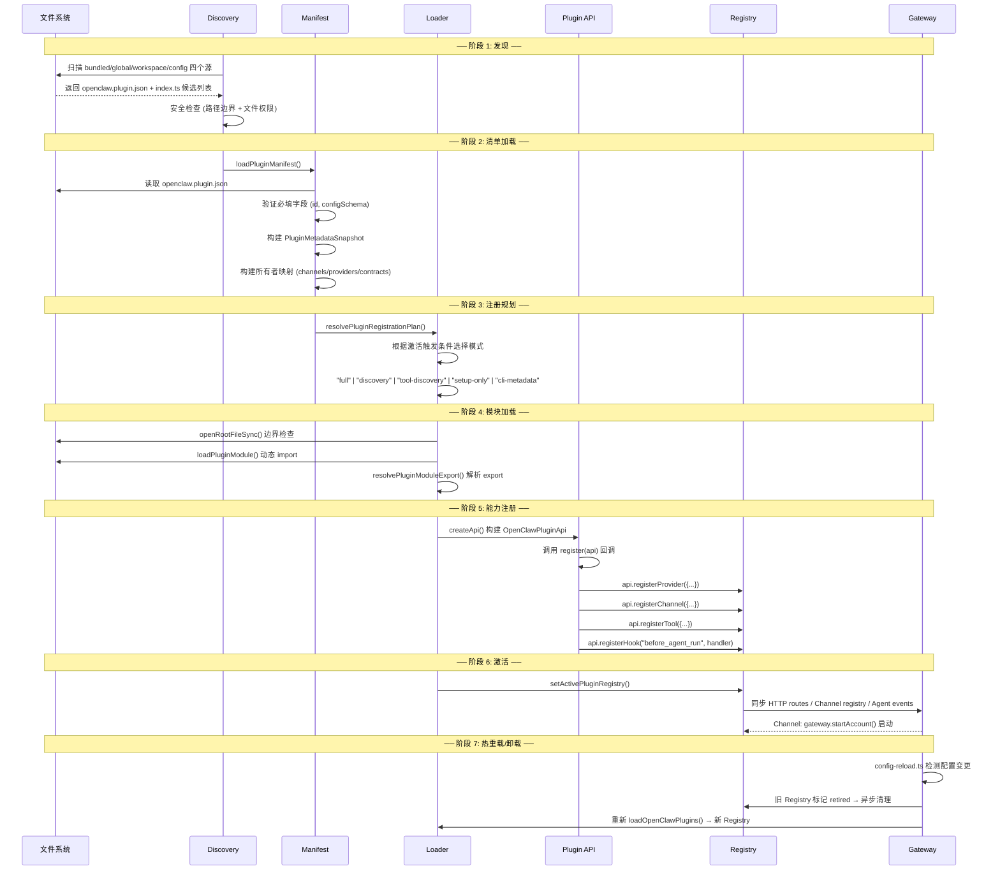

# Phase 6：Plugin/Extension 层源码深度解析

> 分析对象：OpenClaw 六层架构中的 **L6 Plugin/Extension 层**
> 分析目标：Plugin SDK 契约体系、插件接入方式对比、生命周期、二次开发复用性、内置插件全景

---

## 一、Plugin/Extension 层在整体架构中的位置

```
┌──────────────────────────────────────────────────────────────┐
│                    L6 Plugin/Extension 层                     │
│                                                              │
│  ┌──────────────────────────────────────────────────────┐   │
│  │          Plugin SDK 契约 (src/plugin-sdk/)            │   │
│  │    ~300 个公共子路径，7 个私有，50 个 deprecated       │   │
│  │   definePluginEntry / defineChannelPluginEntry        │   │
│  │   defineSingleProviderPluginEntry                     │   │
│  └──────────────────────┬───────────────────────────────┘   │
│                         │ implements                         │
│  ┌──────────────────────┴───────────────────────────────┐   │
│  │        插件实例 (extensions/<id>/)                     │   │
│  │   ~130 个插件，按能力分类:                             │   │
│  │   Provider(40+) / Channel(25+) / Memory(3) /          │   │
│  │   Media/TTS(14+) / Tools(10+) / Other(10+)            │   │
│  └──────────────────────┬───────────────────────────────┘   │
│                         │ 注册到                             │
│  ┌──────────────────────┴───────────────────────────────┐   │
│  │    Plugin Registry + Loader (src/plugins/)            │   │
│  │    发现 → 清单加载 → 模块加载 → register(api) → 激活  │   │
│  └──────────────────────────────────────────────────────┘   │
└──────────────────────────────────────────────────────────────┘
         │                │                │
         ▼                ▼                ▼
    L5 Agent 层      L3 Channels 层    L2 Gateway 层
  (Provider 调用)   (Channel 管理)   (HTTP Routes/Methods)
```

**核心定位**：L6 层是 OpenClaw 的"能力市场"——所有非核心的业务能力（模型推理、消息渠道、记忆存储、媒体生成、Web 搜索等）都以插件形式存在。Core 保持 **plugin-agnostic**，不硬编码任何厂商身份。插件只通过 `openclaw/plugin-sdk/*` 公共子路径进入核心。

---

## 二、源码目录结构

```
src/plugin-sdk/                        ← Plugin SDK 契约源 (~500 文件)
├── entrypoints.ts                     ← SDK 入口点清单与分类
├── core.ts                            ← defineChannelPluginEntry 等核心导出
├── plugin-entry.ts                    ← definePluginEntry (通用插件入口)
├── provider-entry.ts                  ← defineSingleProviderPluginEntry (Provider 入口)
├── channel-entry-contract.ts          ← defineBundledChannelEntry (内置 Channel 入口)
├── channel-contract.ts                ← Channel 公共类型重导出
├── channel-config-schema.ts           ← Channel 配置 Schema 构建器
├── provider-stream-shared.ts          ← Provider Stream 共享工具
├── inbound-reply-dispatch.ts          ← Channel 入站消息分发封装
├── api-baseline.ts                    ← SDK 公共 API 基线
└── ...

src/plugins/                           ← Plugin Loader & Registry (~30 文件)
├── types.ts                           ← OpenClawPluginApi 完整类型 (~310 行)
├── registry.ts                        ← 全局插件注册表实现 (~3097 行)
├── loader.ts                          ← 插件加载器 (~2570 行)
├── manifest.ts                        ← openclaw.plugin.json Schema 与解析
├── manifest-types.ts                  ← Manifest 相关类型
├── manifest-registry.ts               ← Manifest 注册表
├── discovery.ts                       ← 插件发现与扫描
├── activation-planner.ts              ← 激活规划器
├── runtime.ts                         ← setActivePluginRegistry()
├── runtime/index.ts                   ← createPluginRuntime()
├── runtime/load-context.ts            ← 加载上下文解析
├── runtime/runtime-channel.ts         ← Channel Runtime 门面
├── config-schema.ts                   ← 插件配置 Schema 构建
├── plugin-metadata-snapshot.ts        ← PluginMetadataSnapshot 构建
├── registry-lifecycle.ts              ← 注册表生命周期标记
├── api-lifecycle.ts                   ← API 方法生命周期策略
├── tool-types.ts                      ← 工具注册上下文类型
└── ...

extensions/                            ← 插件实例 (~130 个子目录)
├── <provider>/                        ← Provider 插件 (deepseek, openai, anthropic, ...)
│   ├── openclaw.plugin.json           ← 插件清单 (Manifest-first)
│   ├── index.ts                       ← 入口 (defineSingleProviderPluginEntry)
│   ├── stream.ts / thinking.ts / ...  ← 厂商特定实现
│   └── package.json
├── <channel>/                         ← Channel 插件 (telegram, discord, whatsapp, ...)
│   ├── openclaw.plugin.json
│   ├── index.ts                       ← 入口 (defineBundledChannelEntry)
│   ├── src/channel.ts                 ← ChannelPlugin 实现
│   ├── src/runtime-api.send.ts        ← 出站消息发送
│   ├── src/runtime-api.monitor.ts     ← 入站消息监听
│   └── ...
├── memory-core/                       ← Memory 插件
├── memory-lancedb/                    ← LanceDB 向量记忆
└── ...

packages/
├── plugin-sdk/                        ← @openclaw/plugin-sdk 内部包
│   └── package.json                   ← exports map (~60 个子路径)
└── plugin-package-contract/           ← 外部插件 package.json 校验
```

---

## 三、插件契约体系详解

### 3.1 什么是插件契约？

插件契约是一个**三层体系**，定义了插件与 OpenClaw Core 之间的全部交互边界：

```
层1: Manifest 契约 (openclaw.plugin.json)
  → 声明式元数据，在插件运行时加载之前即可被系统消费
  → 用于: 服务发现、配置校验、激活决策、模型目录构建

层2: 注册契约 (register(api) 回调)
  → 插件通过 OpenClawPluginApi 注册自身能力到全局注册表
  → 用于: Provider/Channel/Tool/Hook/Command/Route 等 40+ 种能力注册

层3: 运行时契约 (PluginRuntime 门面)
  → 插件通过注入的 PluginRuntime 对象访问 Core 提供的受控能力
  → 用于: LLM 调用、TTS、媒体生成、会话管理、消息路由等
```

### 3.2 层1: Manifest 契约 (`openclaw.plugin.json`)

> 源码：`src/plugins/manifest.ts:291-394`

```typescript
type PluginManifest = {
  // ━━ 必填 ━━
  id: string; // 插件唯一标识
  configSchema: JsonSchemaObject; // 配置 JSON Schema

  // ━━ 能力所有权声明 (注册前声明) ━━
  channels?: string[]; // 拥有的 Channel ID 列表
  providers?: string[]; // 拥有的 Provider ID 列表
  cliBackends?: string[]; // CLI 后端
  skills?: string[]; // 技能目录
  contracts?: PluginManifestContracts; // 契约声明 (tools/providers/embedders/...)

  // ━━ 激活规划 ━━
  activation?: {
    onStartup?: boolean; // 启动时自动激活
    onProviders?: string[]; // 依赖的 Provider 触发
    onAgentHarnesses?: string[]; // 依赖的 Harness 触发
    onCommands?: string[]; // 命令触发
    onChannels?: string[]; // Channel 触发
    onCapabilities?: PluginManifestActivationCapability[];
  };

  // ━━ 模型目录 (Provider 插件核心) ━━
  modelCatalog?: PluginManifestModelCatalog;
  modelPricing?: PluginManifestModelPricing;
  providerEndpoints?: PluginManifestProviderEndpoint[];
  providerAuthEnvVars?: Record<string, string[]>;
  providerAuthChoices?: PluginManifestProviderAuthChoice[];

  // ━━ Channel 环境变量 ━━
  channelEnvVars?: Record<string, string[]>;

  // ━━ 元数据 ━━
  kind?: PluginKind | PluginKind[]; // "memory" | "context-engine"
  name?: string;
  description?: string;
  version?: string;
  uiHints?: Record<string, PluginConfigUiHint>;
};
```

**Manifest-first 设计原则**：系统在加载插件运行时之前，仅通过 manifest 就能完成：

- 服务发现（哪些插件提供哪些 Provider/Channel）
- 配置校验（对照 `configSchema` 验证用户配置）
- 激活决策（根据 `activation.*` 决定何时加载插件）
- 环境变量需求分析（`channelEnvVars`、`providerAuthEnvVars`）

### 3.3 层2: 注册契约 — `OpenClawPluginApi` 完整方法清单

> 源码：`src/plugins/types.ts:2566-2875` (~310 行)

插件通过 `register(api: OpenClawPluginApi)` 回调接收 API 对象。API 提供 **约 40 个注册方法** + 4 个子命名空间 facade。

#### 3.3.1 基础属性

```typescript
type OpenClawPluginApi = {
  id: string;                              // 插件 ID
  name: string;                            // 插件名称
  version?: string;                        // 版本
  description?: string;                    // 描述
  source: string;                          // 来源标签
  rootDir?: string;                        // 插件根目录
  registrationMode: PluginRegistrationMode; // 当前注册模式
  config: OpenClawConfig;                  // 全局配置 (只读)
  pluginConfig?: Record<string, unknown>;  // 本插件专属配置
  runtime: PluginRuntime;                  // 运行时门面
  logger: PluginLogger;                    // 日志接口

  // 子命名空间 facade
  session: OpenClawPluginSessionApi;       // → state / workflow / controls
  agent: OpenClawPluginAgentApi;           // → events
  runContext: OpenClawPluginRunContextApi;  // → setRunContext / getRunContext / clearRunContext
  lifecycle: OpenClawPluginLifecycleApi;    // → registerRuntimeLifecycle

  // ===== 以下为所有 register*() 方法 =====
```

#### 3.3.2 全部注册方法签名 (按功能域)

**Provider 注册 (模型推理)**：

```typescript
  // 注册 LLM 文本推理 Provider
  registerProvider: (provider: ProviderPlugin) => void;

  // 注册统一模型目录 Provider
  registerModelCatalogProvider: (provider: UnifiedModelCatalogProviderPlugin) => void;

  // 注册嵌入向量 Provider
  registerEmbeddingProvider: (adapter: EmbeddingProviderAdapter) => void;

  // 注册 CLI 推理后端 (如 claude-cli, codex)
  registerCliBackend: (backend: CliBackendPlugin) => void;
```

**Channel 注册 (消息渠道)**：

```typescript
  registerChannel: (
    registration: OpenClawPluginChannelRegistration | ChannelPlugin
  ) => void;
```

**Agent 工具注册**：

```typescript
  // 注册 Agent 工具 (对象或延迟工厂)
  registerTool: (
    tool: AnyAgentTool | OpenClawPluginToolFactory,
    opts?: OpenClawPluginToolOptions,
  ) => void;

  // 注册工具元数据 (展示/策略)
  registerToolMetadata: (metadata: PluginToolMetadataRegistration) => void;

  // 注册受信任工具策略 (仅内置插件)
  registerTrustedToolPolicy: (policy: PluginTrustedToolPolicyRegistration) => void;

  // 注册工具结果中间件
  registerAgentToolResultMiddleware: (
    handler: AgentToolResultMiddleware,
    options?: AgentToolResultMiddlewareOptions,
  ) => void;
```

**Hook 与生命周期**：

```typescript
  registerHook: (
    events: string | string[],
    handler: InternalHookHandler,
    opts?: OpenClawPluginHookOptions,
  ) => void;

  registerRuntimeLifecycle: (
    lifecycle: PluginRuntimeLifecycleRegistration
  ) => void;

  registerAgentEventSubscription: (
    subscription: PluginAgentEventSubscriptionRegistration
  ) => void;

  // 类型安全 Hook 注册 (替代 registerHook)
  on: <K extends PluginHookName>(
    hookName: K,
    handler: PluginHookHandlerMap[K],
    opts?: {...},
  ) => void;
```

**媒体生成注册**：

```typescript
  registerImageGenerationProvider: (provider: ImageGenerationProviderPlugin) => void;
  registerVideoGenerationProvider: (provider: VideoGenerationProviderPlugin) => void;
  registerMusicGenerationProvider: (provider: MusicGenerationProviderPlugin) => void;
  registerMediaUnderstandingProvider: (provider: MediaUnderstandingProviderPlugin) => void;
```

**语音注册**：

```typescript
  registerSpeechProvider: (provider: SpeechProviderPlugin) => void;
  registerRealtimeTranscriptionProvider: (provider: RealtimeTranscriptionProviderPlugin) => void;
  registerRealtimeVoiceProvider: (provider: RealtimeVoiceProviderPlugin) => void;
```

**Web 搜索/抓取注册**：

```typescript
  registerWebFetchProvider: (provider: WebFetchProviderPlugin) => void;
  registerWebSearchProvider: (provider: WebSearchProviderPlugin) => void;
```

**Gateway / HTTP / CLI 扩展**：

```typescript
  registerHttpRoute: (params: OpenClawPluginHttpRouteParams) => void;
  registerGatewayMethod: (
    method: string,
    handler: GatewayRequestHandler,
    opts?: { scope?: OperatorScope },
  ) => void;
  registerGatewayDiscoveryService: (service: OpenClawGatewayDiscoveryService) => void;
  registerCli: (registrar: OpenClawPluginCliRegistrar, opts?: {...}) => void;
  registerNodeCliFeature: (registrar: OpenClawPluginCliRegistrar, opts?: {...}) => void;
  registerCommand: (command: OpenClawPluginCommandDefinition) => void;
  registerInteractiveHandler: (registration: PluginInteractiveHandlerRegistration) => void;
```

**Memory 注册**：

```typescript
  registerContextEngine: (id: string, factory: ContextEngineFactory) => void;
  registerCompactionProvider: (provider: CompactionProvider) => void;
  registerMemoryCapability: (capability: MemoryPluginCapability) => void;
  registerMemoryPromptSupplement: (builder: MemoryPromptSectionBuilder) => void;
  registerMemoryCorpusSupplement: (supplement: MemoryCorpusSupplement) => void;
  registerMemoryEmbeddingProvider: (adapter: MemoryEmbeddingProviderAdapter) => void;
```

**基础设施注册**：

```typescript
  registerReload: (registration: OpenClawPluginReloadRegistration) => void;
  registerService: (service: OpenClawPluginService) => void;
  registerConfigMigration: (migrate: PluginConfigMigration) => void;
  registerMigrationProvider: (provider: MigrationProviderPlugin) => void;
  registerTextTransforms: (transforms: PluginTextTransformRegistration) => void;
  registerAutoEnableProbe: (probe: PluginSetupAutoEnableProbe) => void;
  registerAgentHarness: (harness: AgentHarness) => void;
  registerDetachedTaskRuntime: (runtime: DetachedTaskLifecycleRuntime) => void;
  registerNodeHostCommand: (command: OpenClawPluginNodeHostCommand) => void;
  registerNodeInvokePolicy: (policy: OpenClawPluginNodeInvokePolicy) => void;
  registerSecurityAuditCollector: (collector: OpenClawPluginSecurityAuditCollector) => void;
  registerCodexAppServerExtensionFactory: (factory: CodexAppServerExtensionFactory) => void;
  registerHostedMediaResolver: (resolver: OpenClawPluginHostedMediaResolver) => void;
```

**会话管理 (通过 `api.session.*` facade)**：

```typescript
  session.state.registerSessionExtension: (
    extension: PluginSessionExtensionRegistration
  ) => void;
  session.workflow.registerSessionSchedulerJob: (
    job: PluginSessionSchedulerJobRegistration
  ) => PluginSessionSchedulerJobHandle | undefined;
  session.controls.registerSessionAction: (
    action: PluginSessionActionRegistration
  ) => void;
  session.controls.registerControlUiDescriptor: (
    descriptor: PluginControlUiDescriptor
  ) => void;
```

````

### 3.4 层3: 运行时契约 — `PluginRuntime`

> 源码：`src/plugins/runtime/index.ts:225`

```typescript
function createPluginRuntime(options): PluginRuntime
````

`PluginRuntime` 是注入给插件的**受控运行时门面**，包含以下命名空间：

| 命名空间                     | 提供能力                            |
| ---------------------------- | ----------------------------------- |
| `runtime.config`             | 读取配置（惰性求值）                |
| `runtime.agent`              | Agent 元数据                        |
| `runtime.system`             | 系统信息                            |
| `runtime.tts`                | TTS 语音合成 (惰性加载)             |
| `runtime.mediaUnderstanding` | 媒体理解 (惰性加载)                 |
| `runtime.imageGeneration`    | 图像生成                            |
| `runtime.videoGeneration`    | 视频生成                            |
| `runtime.musicGeneration`    | 音乐生成                            |
| `runtime.llm`                | LLM 调用 (惰性加载)                 |
| `runtime.modelAuth`          | 模型认证 (惰性加载)                 |
| `runtime.subagent`           | 子 Agent 运行时 (惰性绑定)          |
| `runtime.nodes`              | Node 设备运行时 (惰性绑定)          |
| `runtime.channel`            | **Channel 运行时** — 10+ 子命名空间 |

**Channel Runtime** (`runtime/runtime-channel.ts:89`) 是最大的命名空间，包含：

```
runtime.channel
  ├── .text        — 文本分块函数
  ├── .reply       — 入站消息分发/信封/回复 (dispatchReplyWithBufferedBlockDispatcher)
  ├── .routing     — Agent 会话路由
  ├── .pairing     — Channel 配对
  ├── .media       — 媒体获取/存储
  ├── .activity    — Channel 活动日志
  ├── .session     — 会话存储/元数据
  ├── .mentions    — Mention 匹配
  ├── .reactions   — ACK/Reaction 处理
  ├── .groups      — Channel Group 策略
  ├── .debounce    — 入站防抖
  ├── .commands    — 命令门控
  ├── .outbound    — 出站适配器加载
  ├── .turn        — Agent Turn 执行内核
  └── .threadBindings — 线程/会话绑定管理
```

### 3.5 不同插件类型的接入方式对比

OpenClaw 提供 **4 种入口工厂函数**，适用于不同类型的插件：

| 入口函数                            | 适用插件类型                                    | 公开/内置  | 关键特征                                                                                        |
| ----------------------------------- | ----------------------------------------------- | ---------- | ----------------------------------------------------------------------------------------------- |
| `definePluginEntry()`               | 通用插件 (Memory/Tool/Service/ContextEngine...) | **公开**   | 直接传入 `register(api)` 回调                                                                   |
| `defineChannelPluginEntry()`        | 第三方 Channel 插件                             | **公开**   | 自动调用 `api.registerChannel()`，按 `registrationMode` 分流                                    |
| `defineSingleProviderPluginEntry()` | 单 Provider 插件 (OpenAI 兼容)                  | **公开**   | 自动构建 Auth/Catalog，自动调用 `api.registerProvider()` + `api.registerModelCatalogProvider()` |
| `defineBundledChannelEntry()`       | 内置 Channel 插件                               | **仅内置** | 延迟加载子模块 (plugin/outbound/secrets/runtime)，独立 setup entry                              |

#### 3.5.1 通用插件入口: `definePluginEntry`

```typescript
// src/plugin-sdk/plugin-entry.ts:267
definePluginEntry({
  id: "my-plugin",
  name: "My Plugin",
  description: "...",
  configSchema?: OpenClawPluginConfigSchema,
  register(api: OpenClawPluginApi) {
    // 在这里调用 api.register*() 注册能力
    api.registerTool(myTool);
    api.registerHook("before_agent_run", myHandler);
    api.registerCommand({ name: "my-cmd", ... });
  },
});
```

#### 3.5.2 Provider 专用入口: `defineSingleProviderPluginEntry`

```typescript
// src/plugin-sdk/provider-entry.ts:154
defineSingleProviderPluginEntry({
  id: "my-provider",
  name: "My Provider",
  provider: {
    label: "My Provider",
    docsPath: "/providers/my-provider",
    auth: [{
      methodId: "api-key",
      label: "API Key",
      envVar: "MY_PROVIDER_API_KEY",
    }],
    catalog: {
      buildProvider: (cfg) => ({
        baseUrl: "https://api.my-provider.com/v1",
        api: "openai-completions",
        models: [{ id: "my-model", name: "...", contextWindow: 128000 }],
      }),
    },
    wrapStreamFn: (ctx) => ctx.streamFn,  // 可选的请求/响应包装
    resolveThinkingProfile: ({ modelId }) => ({ ... }),
  },
});
```

内部自动完成：

1. 调用 `definePluginEntry`
2. 构建 `ProviderPlugin` 对象（id, label, auth, catalog, hooks）
3. 调用 `api.registerProvider(provider)`
4. 调用 `api.registerModelCatalogProvider(catalogProvider)`

#### 3.5.3 Channel 公开入口: `defineChannelPluginEntry`

```typescript
// src/plugin-sdk/core.ts:532
defineChannelPluginEntry({
  id: "my-channel",
  name: "My Channel",
  description: "...",
  plugin: myChannelPlugin,            // ChannelPlugin 实例
  configSchema?: myConfigSchema,
  setRuntime?: (runtime) => { ... },  // 保存 PluginRuntime 引用
  registerFull?: (api) => {           // 完整注册回调
    api.registerTool(myChannelTool);
    api.registerGatewayMethod("myChannel.action", handler);
  },
});
```

内部按 `registrationMode` 智能分流：

```
registrationMode === "cli-metadata"   → 只注册 CLI metadata
registrationMode === "tool-discovery" → 只注册 tools
registrationMode === "discovery"      → 注册 channel + CLI metadata
registrationMode === "full"           → 注册 channel + CLI metadata + full runtime
```

#### 3.5.4 各入口的异同总结

| 维度             | definePluginEntry                    | defineChannelPluginEntry | defineSingleProviderPluginEntry  | defineBundledChannelEntry           |
| ---------------- | ------------------------------------ | ------------------------ | -------------------------------- | ----------------------------------- |
| 第三方可用       | ✅                                   | ✅                       | ✅                               | ❌ (仅内置)                         |
| 自动注册能力     | 无                                   | 自动注册 Channel         | 自动注册 Provider + ModelCatalog | 自动注册 Channel (延迟加载)         |
| 子模块加载方式   | N/A                                  | 直接传入对象             | 直接传入配置                     | 延迟加载 (specifier + exportName)   |
| setup entry 分离 | 无                                   | 无                       | 无                               | 有 (defineBundledChannelSetupEntry) |
| 适用插件类型     | Memory/Tool/Service/ContextEngine... | Channel                  | 单 Provider (OpenAI 兼容)        | 内置 Channel                        |

---

## 四、插件生命周期详解

### 4.0 生命周期全景图



### 4.1 完整生命周期

```
┌─────────────────────────────────────────────────────────────────────┐
│                    插件完整生命周期 (7 个阶段)                         │
├──────────┬──────────────────────────────────────────────────────────┤
│ 1. 发现  │ discoverOpenClawPlugins()                                 │
│          │ 扫描 4 个源: bundled / global / workspace / config        │
│          │ 定位 openclaw.plugin.json + index.ts                      │
├──────────┼──────────────────────────────────────────────────────────┤
│ 2. 清单  │ loadPluginManifest()                                      │
│   加载   │ 解析 + 验证 openclaw.plugin.json                          │
│          │ 构建 PluginMetadataSnapshot (元数据快照)                    │
├──────────┼──────────────────────────────────────────────────────────┤
│ 3. 注册  │ resolvePluginRegistrationPlan() → 选择注册模式              │
│   规划   │ PluginRegistrationMode:                                    │
│          │   "full" | "discovery" | "tool-discovery"                 │
│          │   | "setup-only" | "setup-runtime" | "cli-metadata"      │
├──────────┼──────────────────────────────────────────────────────────┤
│ 4. 模块  │ loadPluginModule() → 动态 import 插件 JS/TS 模块           │
│   加载   │ 边界安全检查 (openRootFileSync)                             │
│          │ 配置校验 (对照 configSchema)                                │
├──────────┼──────────────────────────────────────────────────────────┤
│ 5. 能力  │ createApi() → 构建 OpenClawPluginApi 实例                  │
│   注册   │ 调用 register(api) → api.registerProvider/Channel/...      │
│          │ 所有注册写入 PluginRegistry                                │
├──────────┼──────────────────────────────────────────────────────────┤
│ 6. 激活  │ setActivePluginRegistry()                                  │
│          │ → 同步 HTTP routes / Channel registry / Agent events       │
│          │ → Channel: gateway.startAccount() 启动长连接               │
│          │ → Provider: 模型目录被 Agent 层消费                        │
├──────────┼──────────────────────────────────────────────────────────┤
│ 7. 运行  │ 插件通过 PluginRuntime 门面与 Core 交互                     │
│   与     │ 热重载: config-reload.ts 检测配置变更                      │
│   卸载   │ → reload-plugins 或 restart-gateway                       │
│          │ → 旧 PluginRegistry 标记为 retired → 异步清理              │
└──────────┴──────────────────────────────────────────────────────────┘
```

### 4.2 PluginRegistrationMode — 注册模式控制

> 源码：`src/plugins/types.ts:2359-2365`

```typescript
type PluginRegistrationMode =
  | "full" // 完整激活 — 启动长驻副作用 (Channel 连接、定时器等)
  | "discovery" // 只读能力发现 — 跳过 socket/worker/client
  | "tool-discovery" // 工具元数据扫描 — 跳过 Channel runtime 初始化
  | "setup-only" // 轻量 setup 入口 — 仅配置向导
  | "setup-runtime" // setup 流程 + runtime Channel 入口
  | "cli-metadata"; // CLI 命令元数据收集
```

不同模式控制哪些 `api.register*()` 方法真实可用：

| 模式             | capabilityHandlers      | runtimeChannel |
| ---------------- | ----------------------- | -------------- |
| `full`           | ✅ 全部                 | ✅             |
| `discovery`      | ✅                      | ✅             |
| `tool-discovery` | ✅                      | ❌             |
| `setup-only`     | ❌ (仅 registerChannel) | ❌             |
| `cli-metadata`   | ❌ (仅 registerCli)     | ❌             |

### 4.3 热重载机制

> 源码：`src/gateway/config-reload.ts`, `config-reload-plan.ts`

当 `openclaw.json` 配置变更时：

```
config-reload.ts
  → diffConfigPaths() — 比较新旧配置
  → buildGatewayReloadPlan() — 构建重载计划

重载决策规则 (BASE_RELOAD_RULES):
  plugins.load        → restart (必须重启)
  plugins.installs    → restart
  plugins.*           → hot → reload-plugins + dispose-mcp-runtimes
  hooks               → hot → reload-hooks
  agents.defaults.*   → hot → restart-heartbeat
  gateway.*           → restart
  channels.<id>       → hot → restartChannels.add(channelId)
```

**插件可扩展热重载规则** — 通过 `api.registerReload()`:

```typescript
api.registerReload({
  restartPrefixes: ["my-plugin.dangerous"],
  hotPrefixes: ["my-plugin.safe"],
  noopPrefixes: ["my-plugin.cosmetic"],
});
```

### 4.4 插件隔离机制

1. **源路径边界检查** (`discovery.ts:115`): `checkSourceEscapesRoot()` — 插件源文件的真实路径必须在插件根目录内
2. **文件权限检查** (`discovery.ts:97`): 非 bundled 插件不能是全局可写或具有可疑所有权
3. **API 守卫** (`loader.ts:482`): `createGuardedPluginRegistrationApi()` — `register()` 返回后，API 的注册方法被 Proxy 拦截
4. **模块加载隔离** (`loader.ts:532`): `installOpenClawPluginSdkNativeResolver()` + `createPluginModuleLoaderCache()` — 独立的模块加载缓存

---

## 五、内置插件全景与接口衔接

### 5.1 插件全景分类

| 类别                 | 数量 | 典型插件                                                                                                                                                                                                                                                                                                                                                                                                                                     | 注册的核心能力                                                              |
| -------------------- | ---- | -------------------------------------------------------------------------------------------------------------------------------------------------------------------------------------------------------------------------------------------------------------------------------------------------------------------------------------------------------------------------------------------------------------------------------------------- | --------------------------------------------------------------------------- |
| **Provider (模型)**  | ~40+ | deepseek, openai, anthropic, google, groq, ollama, vllm, openrouter, bedrock, litellm, mistral, moonshot, qwen, xai, together, fireworks, cerebras, minimax, stepfun, tencent, volcengine, zai, sglang, lmstudio, nvidia, huggingface, microsoft, arcee, chutes, venice, xiaomi, synthetic, cloudflare-ai-gateway, vercel-ai-gateway, github-copilot, copilot-proxy, gradium, kilocode, kimi-coding, opencode, voyage, llm-task, acpx, codex | `api.registerProvider()` + `api.registerModelCatalogProvider()`             |
| **Channel (渠道)**   | ~25+ | telegram, discord, whatsapp, slack, signal, imessage, irc, matrix, mattermost, msteams, feishu, line, googlechat, qqbot, zalo, zalouser, nextcloud-talk, synology-chat, bonjour, nostr, tlon, twitch, webhooks, clickclack, lobster                                                                                                                                                                                                          | `api.registerChannel()`                                                     |
| **Memory (记忆)**    | 3    | memory-core, memory-lancedb, memory-wiki                                                                                                                                                                                                                                                                                                                                                                                                     | `api.registerMemoryCapability()` + `api.registerTool()`                     |
| **Media/TTS (媒体)** | ~14  | image-generation-core, video-generation-core, media-understanding-core, speech-core, comfy, fal, runway, elevenlabs, deepgram, senseaudio, tts-local-cli, azure-speech, talk-voice, voice-call                                                                                                                                                                                                                                               | `api.registerImageGenerationProvider()` / `api.registerSpeechProvider()` 等 |
| **Web/Browser**      | ~7   | browser, brave, searxng, duckduckgo, firecrawl, tavily, exa                                                                                                                                                                                                                                                                                                                                                                                  | `api.registerWebSearchProvider()` / `api.registerWebFetchProvider()`        |
| **Tools**            | ~10  | document-extract, file-transfer, web-readability, diffs, tokenjuice, thread-ownership, openshell, canvas, phone-control, policy                                                                                                                                                                                                                                                                                                              | `api.registerTool()`                                                        |
| **Other**            | ~10  | admin-http-rpc, active-memory, device-pair, diagnostics-otel, diagnostics-prometheus, google-meet, inworld, skill-workshop, qa-\*, open-prose                                                                                                                                                                                                                                                                                                | 多种                                                                        |

### 5.2 不同插件类型与其他模块的接口衔接

#### 5.2.1 Provider 插件 ↔ Agent 层调用链

```
Agent 层需要 LLM 推理
  │
  ▼
src/agents/provider-stream.ts
  registerProviderStreamForModel({ model, cfg })
  │
  ├─ resolveProviderStreamFn()
  │   → 在 registry.providers 中查找匹配的 ProviderPlugin
  │   → 检查是否有自定义 createStreamFn
  │
  ├─ createTransportAwareStreamFnForModel()
  │   → 基于 baseUrl + api + headers 构建标准 HTTP 传输
  │
  └─ ensureCustomApiRegistered(model.api, streamFn)
      → 注册到 pi-ai 库的 stream() 路由
```

**Provider 插件提供的钩子被调用的时机：**

| 钩子                          | 调用时机                           | 来源                                   |
| ----------------------------- | ---------------------------------- | -------------------------------------- |
| `wrapStreamFn`                | LLM 调用前，包装请求/响应          | `src/plugins/provider-runtime.ts`      |
| `resolveThinkingProfile`      | 模型选择时，获取推理级别           | `src/plugins/provider-hook-runtime.ts` |
| `buildReplayPolicy`           | Compaction 重放时                  | `src/plugins/provider-hook-runtime.ts` |
| `normalizeToolSchemas`        | 工具 Schema 传给 LLM 前            | `src/plugins/provider-tools.ts`        |
| `matchesContextOverflowError` | LLM 返回错误时，判断是否上下文溢出 | `src/agents/model-fallback.ts`         |

#### 5.2.2 Channel 插件 ↔ Gateway 层管理链路

```
Gateway 启动
  │
  ▼
src/gateway/server-channels.ts
  createChannelManager()
  │
  ├─ startChannels()
  │   └─ startChannelInternal(channelId, accountId?)
  │       ├─ plugin = getChannelPlugin("telegram")    ← 从 registry 获取
  │       └─ plugin.gateway.startAccount({ cfg, accountId, runtime, abortSignal, ... })
  │           │
  │           ▼ Channel 插件启动长连接/轮询/Webhook
  │
  └─ stopChannel(channelId)
      ├─ abort 对应 AbortController
      └─ plugin.gateway.stopAccount()
```

**ChannelPlugin 在 Gateway 端的完整管理接口：**

| 阶段     | 方法                                       | 说明                                           |
| -------- | ------------------------------------------ | ---------------------------------------------- |
| 启动     | `gateway.startAccount(ctx)`                | 启动消息接收（WebSocket/长轮询/Webhook）       |
| 运行     | `gateway.startAccount` 内部的监听循环      | 接收平台消息 → 构建 MsgContext → 调用 dispatch |
| 停止     | `gateway.stopAccount(ctx)`                 | 优雅关闭连接                                   |
| 配置变更 | `lifecycle.onAccountConfigChanged(params)` | 热更新账户配置                                 |
| 健康检查 | `status.getSnapshot(accountId)`            | 获取连接状态快照                               |

#### 5.2.3 Memory 插件 ↔ 记忆系统集成

```
Agent 需要记忆搜索
  │
  ▼
src/agents/memory-search.ts
  resolveMemorySearchConfig(cfg, agentId)
  │
  ▼
extensions/memory-core/src/manager.ts
  MemoryIndexManager.search(query)
  │
  ├─ 向量搜索 (EmbeddingProvider)
  ├─ FTS5 关键词搜索 (SQLite)
  └─ mergeHybridResults() → MMR + 时间衰减
  │
  ▼ 返回 <relevant-memories> 注入 System Prompt
```

Memory 插件通过 `api.registerMemoryCapability()` 注册：

- `promptBuilder`: 构建记忆使用指南（注入 System Prompt）
- `flushPlanResolver`: 构建记忆刷新计划
- `runtime`: `MemoryPluginRuntime` — 获取/关闭 MemorySearchManager

#### 5.2.4 MCP 工具集成 (核心层实现)

MCP 功能实现在 `src/mcp/` 而非插件中：

```
src/mcp/plugin-tools-handlers.ts
  createPluginToolsMcpHandlers(tools: AnyAgentTool[])
  │
  ├─ listTools() → 映射 tool.name + description + parameters 到 MCP Schema
  └─ callTool({ name, arguments })
      └─ tool.execute(toolCallId, params)
          └─ 每个工具自动用 wrapToolWithBeforeToolCallHook() 包装
```

### 5.3 Manifest 结构对比

| 字段                     | Provider (deepseek)                        | Channel (telegram)                     | Memory (memory-core)                                                           |
| ------------------------ | ------------------------------------------ | -------------------------------------- | ------------------------------------------------------------------------------ |
| `id`                     | `"deepseek"`                               | `"telegram"`                           | `"memory-core"`                                                                |
| `activation.onStartup`   | `false`                                    | `false`                                | `false`                                                                        |
| `kind`                   | —                                          | —                                      | `"memory"`                                                                     |
| `providers` / `channels` | `["deepseek"]`                             | `["telegram"]`                         | —                                                                              |
| `modelCatalog`           | 详细模型表 (model, contextWindow, pricing) | —                                      | —                                                                              |
| `providerAuthEnvVars`    | `{"deepseek": ["DEEPSEEK_API_KEY"]}`       | —                                      | —                                                                              |
| `channelEnvVars`         | —                                          | `{"telegram": ["TELEGRAM_BOT_TOKEN"]}` | —                                                                              |
| `contracts`              | —                                          | —                                      | `tools: ["memory_get","memory_search"]`, `memoryEmbeddingProviders: ["local"]` |
| `configSchema`           | `{}`                                       | `{}`                                   | 丰富 (dreaming 频率/模型/阶段)                                                 |

---

## 六、二次开发复用性分析

### 6.1 你可以百分之百复用吗？

**结论：对于第三方插件开发，公共 API 层面可以 100% 复用。内部 API 需避免使用。**

#### 可以 100% 复用的公共 API

| 复用项                              | 复用方式                                                                                     | 说明                           |
| ----------------------------------- | -------------------------------------------------------------------------------------------- | ------------------------------ |
| `definePluginEntry()`               | `import { definePluginEntry } from "openclaw/plugin-sdk"`                                    | 所有通用插件的标准入口         |
| `defineChannelPluginEntry()`        | `import { defineChannelPluginEntry } from "openclaw/plugin-sdk"`                             | Channel 插件的公开入口         |
| `defineSingleProviderPluginEntry()` | `import { defineSingleProviderPluginEntry } from "openclaw/plugin-sdk"`                      | 单 Provider 插件的便捷入口     |
| `OpenClawPluginApi` 全部方法        | 通过 `register(api)` 回调接收                                                                | ~40 个 register\* 方法全部可用 |
| `PluginRuntime`                     | 通过 `setRuntime(runtime)` 或 Channel 的 `runtime` 参数                                      | 受控运行时门面                 |
| Channel 配置 Schema                 | `import { buildChannelConfigSchema } from "openclaw/plugin-sdk/channel-config-schema"`       | Channel 配置校验               |
| Provider Stream 工具                | `import { composeProviderStreamWrappers } from "openclaw/plugin-sdk/provider-stream-shared"` | Stream 管道组合                |
| 测试工具                            | `import { ... } from "openclaw/plugin-sdk/testing"`                                          | 插件单元测试辅助               |

#### 不可复用的内部 API

| 禁止复用项                         | 原因                             |
| ---------------------------------- | -------------------------------- |
| `defineBundledChannelEntry`        | 仅内置插件使用，依赖构建系统集成 |
| `defineBundledChannelSetupEntry`   | 同上                             |
| `bundled-channel-config-schema`    | 仅内置 Channel 的 Schema         |
| `src/plugins/registry.ts` 内部实现 | 不公开暴露                       |
| `src/plugin-sdk-internal/`         | 明确标注 internal                |

### 6.2 插件 SDK 子路径分类

> 源码：`scripts/lib/plugin-sdk-entrypoints.json` — 约 300+ 子路径

| 分类                                       | 数量 | 说明                                                                                                               |
| ------------------------------------------ | ---- | ------------------------------------------------------------------------------------------------------------------ |
| **公开 (public)**                          | ~300 | 第三方可自由使用                                                                                                   |
| **私有 (private-local-only)**              | 7    | qa-channel, qa-channel-protocol, qa-lab, qa-runtime, test-utils                                                    |
| **已废弃但公开 (deprecated public)**       | 50   | 仍可用但建议迁移 (zod, discord, matrix, mattermost, config-schema 等)                                              |
| **内置专用 (reserved bundled)**            | 2    | codex-mcp-projection, codex-native-task-runtime                                                                    |
| **内置 facade (supported bundled facade)** | ~20  | discord, lmstudio, matrix, mattermost, memory-core-engine-runtime 等 — 最终会迁移到通用 contract                   |
| **公开插件持有 (public plugin-owned)**     | ~15  | browser-config, image-generation-core, memory-core, speech-core, telegram-command-config, video-generation-core 等 |

### 6.3 新插件开发完整模板

#### 6.3.1 通用插件 (Memory / Tool / Service / ContextEngine)

**目录结构**：

```
extensions/my-plugin/
├── openclaw.plugin.json
├── package.json
├── index.ts                    ← definePluginEntry
└── src/
    ├── api.ts                  ← 公共 API 导出
    └── runtime.ts              ← 运行时逻辑
```

**完整代码**：

```typescript
// extensions/my-plugin/index.ts
import { definePluginEntry } from "openclaw/plugin-sdk";

export default definePluginEntry({
  id: "my-plugin",
  name: "My Plugin",
  description: "A custom plugin that provides tools and hooks",

  // 可选：插件配置 Schema (用于 openclaw.json 中 plugins.entries.my-plugin.config)
  configSchema: {
    type: "object",
    properties: {
      enabled: { type: "boolean", default: true },
      optionA: { type: "string" },
    },
  },

  // 可选：声明热重载规则
  reload: {
    hotPrefixes: ["plugins.entries.my-plugin.config.optionA"],
    restartPrefixes: ["plugins.entries.my-plugin.config.enabled"],
  },

  register(api) {
    // ━━ 注册 Agent 工具 ━━
    api.registerTool({
      name: "my_tool",
      description: "Description for the LLM",
      parameters: {
        type: "object",
        properties: {
          query: { type: "string", description: "Search query" },
        },
        required: ["query"],
      },
      execute: async (toolCallId, params, signal) => {
        const query = readStringParam(params, "query", { required: true });
        const result = await myApi.search(query);
        return { text: JSON.stringify(result), details: { toolCallId } };
      },
    });

    // ━━ 注册 Hook ━━
    api.registerHook("before_agent_run", async (event) => {
      // 在 Agent 执行前注入上下文
    });

    // ━━ 注册 CLI 命令 ━━
    api.registerCommand({
      name: "my-cmd",
      description: "My custom command",
      handler: async (ctx) => {
        ctx.reply("Command executed!");
      },
    });

    // ━━ 注册服务 ━━
    api.registerService({
      id: "my-service",
      start: async () => {
        /* 启动服务 */
      },
      stop: async () => {
        /* 停止服务 */
      },
    });
  },
});
```

```json
// extensions/my-plugin/openclaw.plugin.json
{
  "id": "my-plugin",
  "activation": { "onStartup": false },
  "contracts": {
    "tools": ["my_tool"]
  },
  "configSchema": {
    "type": "object",
    "additionalProperties": false,
    "properties": {
      "enabled": { "type": "boolean" },
      "optionA": { "type": "string" }
    }
  }
}
```

#### 6.3.2 Provider 插件完整模板

参考 Phase 5 §13.1 的完整模板。关键接口：

| 需实现的钩子                           | 必要性   | 说明                                  |
| -------------------------------------- | -------- | ------------------------------------- |
| `provider.auth`                        | **必填** | 至少一种认证方式 (api-key 最常用)     |
| `provider.catalog`                     | **必填** | `buildProvider` 返回 baseUrl + models |
| `provider.wrapStreamFn`                | 推荐     | 请求/响应体注入 (如 reasoning_effort) |
| `provider.resolveThinkingProfile`      | 推荐     | 声明推理级别                          |
| `provider.matchesContextOverflowError` | 推荐     | 上下文溢出检测 (触发回退)             |
| `provider.normalizeToolSchemas`        | 按需     | 工具 Schema 兼容转换                  |
| `provider.buildReplayPolicy`           | 按需     | Compaction 重放策略                   |

#### 6.3.3 Channel 插件 — `ChannelPlugin` 完整类型

> 源码：`src/channels/plugins/types.plugin.ts:61-106`

```typescript
type ChannelPlugin<ResolvedAccount = any> = {
  // ━━━ 必填 ━━━
  id: ChannelId; // Channel 唯一标识
  meta: ChannelMeta; // 元数据 (label, docsPath, blurb, aliases...)
  capabilities: ChannelCapabilities; // 静态能力声明
  config: ChannelConfigAdapter<ResolvedAccount>; // 配置适配器

  // ━━━ 消息收发 (核心) ━━━
  outbound?: ChannelOutboundAdapter; // 出站消息适配器 (sendText/sendMedia/sendPayload/...)
  gateway?: ChannelGatewayAdapter; // Gateway 生命周期 (startAccount/stopAccount)
  messaging?: ChannelMessagingAdapter; // 消息路由/目标解析

  // ━━━ 会话与线程 ━━━
  threading?: ChannelThreadingAdapter; // 线程/话题支持
  bindings?: ChannelConfiguredBindingProvider;
  conversationBindings?: ChannelConversationBindingSupport;

  // ━━━ 认证与安全 ━━━
  auth?: ChannelAuthAdapter; // 登录/登出流程
  security?: ChannelSecurityAdapter; // DM 安全策略 (allow/deny/approve)
  allowlist?: ChannelAllowlistAdapter; // 白名单管理
  secrets?: ChannelSecretsAdapter; // 密钥管理 (声明敏感配置路径)

  // ━━━ 配置与状态 ━━━
  setup?: ChannelSetupAdapter; // 初始配置向导
  setupWizard?: ChannelSetupWizard; // UI 配置向导
  status?: ChannelStatusAdapter; // 状态/健康检查
  doctor?: ChannelDoctorAdapter; // 配置诊断修复
  lifecycle?: ChannelLifecycleAdapter; // 配置变更/账户移除回调

  // ━━━ 增强功能 ━━━
  heartbeat?: ChannelHeartbeatAdapter; // typing 指示 / 心跳
  groups?: ChannelGroupAdapter; // 群组策略
  directory?: ChannelDirectoryAdapter; // 通讯录/联系人
  mentions?: ChannelMentionAdapter; // @提及处理
  actions?: ChannelMessageActionAdapter; // 消息动作 (react/send/edit)
  streaming?: ChannelStreamingAdapter; // 流式输出配置

  // ━━━ Agent 集成 ━━━
  agentPrompt?: ChannelAgentPromptAdapter; // Agent 提示词定制
  agentTools?: ChannelAgentToolFactory | ChannelAgentTool[]; // 专属工具
  commands?: ChannelCommandAdapter; // 命令策略

  // ━━━ Gateway 扩展 ━━━
  gatewayMethods?: string[];
  gatewayMethodDescriptors?: ChannelGatewayMethodDescriptor[];
  approvalCapability?: ChannelApprovalCapability;
  elevated?: ChannelElevatedAdapter; // 提权适配器
};
```

**Channel 插件完整模板**：

```typescript
// extensions/my-channel/src/channel.ts
import { createChatChannelPlugin } from "openclaw/plugin-sdk/channel-core";
import type { OpenClawConfig } from "openclaw/plugin-sdk/config-contracts";

type ResolvedMyAccount = {
  accountId: string;
  token: string;
  enabled: boolean;
};

function resolveMyAccount(params: {
  cfg: OpenClawConfig;
  accountId?: string | null;
}): ResolvedMyAccount {
  const chCfg = params.cfg.channels?.["my-channel"] as Record<string, unknown> | undefined;
  return {
    accountId: params.accountId ?? "default",
    token: (chCfg?.token as string) ?? process.env.MY_CHANNEL_TOKEN ?? "",
    enabled: chCfg?.enabled !== false,
  };
}

export const myChannelPlugin = createChatChannelPlugin<ResolvedMyAccount>({
  base: {
    id: "my-channel",
    meta: {
      id: "my-channel",
      label: "My Channel",
      selectionLabel: "My Channel",
      docsPath: "/docs/channels/my-channel",
      blurb: "Connect to My Custom Platform",
      markdownCapable: true,
    },
    capabilities: {
      chatTypes: ["direct", "group"],
      media: true,
      reply: true,
    },
    config: {
      listAccountIds: (cfg) => {
        const accounts = (cfg.channels?.["my-channel"] as any)?.accounts;
        return accounts ? Object.keys(accounts) : ["default"];
      },
      resolveAccount: (cfg, accountId) => resolveMyAccount({ cfg, accountId }),
    },

    // 消息路由
    messaging: {
      targetPrefixes: ["my-channel"],
      normalizeTarget: (raw) => raw.replace(/^my-channel:/i, "").trim() || undefined,
      targetResolver: {
        looksLikeId: (raw) => /^\d+$/.test(raw),
        hint: "<userId or groupId>",
      },
    },

    // Gateway 生命周期
    gateway: {
      startAccount: async (ctx) => {
        ctx.log?.info(`[${ctx.accountId}] starting my-channel`);
        ctx.setStatus({ accountId: ctx.accountId, running: true });

        // 启动消息接收 (WebSocket / Polling / Webhook)
        const ws = new WebSocket(`wss://api.myplatform.com/ws?token=${ctx.account.token}`);

        ctx.abortSignal.addEventListener("abort", () => ws.close());

        ws.on("message", async (data) => {
          const msg = JSON.parse(data);
          const msgContext: MsgContext = {
            Body: msg.text,
            From: String(msg.sender_id),
            To: String(msg.chat_id),
            SessionKey: `my-channel:${msg.chat_id}`,
            AccountId: ctx.accountId,
            MessageSid: String(msg.message_id),
            Provider: "my-channel",
            Surface: "my-channel",
            OriginatingChannel: "my-channel",
            OriginatingTo: String(msg.chat_id),
            ChatType: msg.is_group ? "group" : "direct",
            SenderName: msg.sender_name,
            Timestamp: msg.timestamp,
          };

          // 分发到 Agent 执行
          await ctx.channelRuntime?.reply.dispatchReplyWithBufferedBlockDispatcher({
            ctx: msgContext,
            cfg: ctx.cfg,
            dispatcherOptions: {
              deliver: async (payload) => {
                await myChannelPlugin.outbound!.sendText!({
                  cfg: ctx.cfg,
                  to: msgContext.From!,
                  text: payload.text ?? "",
                  accountId: ctx.accountId,
                });
              },
            },
          });
        });
      },

      stopAccount: async (ctx) => {
        ctx.log?.info(`[${ctx.accountId}] stopping my-channel`);
        // WebSocket 连接已通过 abortSignal 关闭
      },
    },

    // 心跳
    heartbeat: {
      sendTyping: async ({ cfg, to, accountId }) => {
        // 调用平台 API 发送 typing 指示
      },
    },
  },

  // 出站适配器
  outbound: {
    deliveryMode: "direct",
    textChunkLimit: 4096,
    sendText: async (ctx) => {
      const account = resolveMyAccount({ cfg: ctx.cfg, accountId: ctx.accountId });
      const result = await fetch(`https://api.myplatform.com/send`, {
        method: "POST",
        headers: {
          Authorization: `Bearer ${account.token}`,
          "Content-Type": "application/json",
        },
        body: JSON.stringify({
          chat_id: ctx.to,
          text: ctx.text,
          reply_to: ctx.replyToId ?? undefined,
        }),
      }).then((r) => r.json());
      return { messageId: result.id, ok: true };
    },

    sendMedia: async (ctx) => {
      // 实现媒体发送
      return { messageId: "media-1", ok: true };
    },
  },

  // 安全
  security: {
    resolveDmPolicy: (ctx) => ({
      policy: ctx.account.enabled ? "allow" : "deny",
      allowFrom: null,
      allowFromPath: "channels.my-channel.allowFrom",
      approveHint: "Add user ID to channels.my-channel.allowFrom",
    }),
  },

  // 配对
  pairing: {
    idLabel: "myChannelUserId",
    normalizeAllowEntry: (entry) => entry.replace(/^my-channel:/i, ""),
  },
});
```

```typescript
// extensions/my-channel/index.ts
import { defineChannelPluginEntry } from "openclaw/plugin-sdk";

export default defineChannelPluginEntry({
  id: "my-channel",
  name: "My Channel",
  description: "Custom channel plugin for My Platform",
  plugin: myChannelPlugin,
  configSchema: {
    type: "object",
    properties: {
      token: { type: "string" },
      enabled: { type: "boolean" },
    },
  },
  setRuntime: (runtime) => {
    /* 保存 PluginRuntime */
  },
  registerFull: (api) => {
    api.registerTool(myChannelTool);
  },
});
```

```json
// extensions/my-channel/openclaw.plugin.json
{
  "id": "my-channel",
  "activation": { "onStartup": false },
  "channels": ["my-channel"],
  "channelEnvVars": {
    "my-channel": ["MY_CHANNEL_TOKEN"]
  },
  "configSchema": {
    "type": "object",
    "additionalProperties": false,
    "properties": {
      "token": { "type": "string" },
      "enabled": { "type": "boolean" },
      "allowFrom": {
        "type": "array",
        "items": { "type": "string" }
      }
    }
  }
}
```

**Channel 适配器实现优先级**：

| 优先级 | 适配器                 | 必须？ | 要做的事                                                           |
| ------ | ---------------------- | ------ | ------------------------------------------------------------------ |
| **P0** | `config`               | 是     | 实现 `listAccountIds` + `resolveAccount`                           |
| **P0** | `gateway.startAccount` | 是     | 启动消息接收（轮询/WebSocket/Webhook）→ 构建 MsgContext → dispatch |
| **P0** | `outbound.sendText`    | 是     | 调用平台 API 发送文本消息                                          |
| **P1** | `outbound.sendMedia`   | 推荐   | 调用平台 API 发送媒体消息                                          |
| **P1** | `messaging`            | 推荐   | 实现目标地址解析和归一化                                           |
| **P1** | `heartbeat.sendTyping` | 推荐   | 发送 typing 状态                                                   |
| **P2** | `setup`                | 可选   | 实现 `applyAccountConfig` 配置写入                                 |
| **P2** | `security`             | 可选   | 实现 DM 安全策略 (allow/deny)                                      |
| **P2** | `status`               | 可选   | 实现健康检查和账户快照                                             |

#### 6.3.4 新插件注意事项

1. **Manifest-first**: 先在 `openclaw.plugin.json` 中声明能力（`channels`, `providers`, `contracts.tools`），运行时注册会校验声明覆盖
2. **配置 Schema 必填**: `configSchema` 是 manifest 的必填字段，不能为空对象
3. **环境变量声明**: Channel 插件应在 `channelEnvVars` 中声明需要的环境变量，Provider 插件应在 `provider.envVars` 或 `auth[].envVar` 中声明
4. **边界安全**: 插件代码只能访问自己的目录和 SDK 公共子路径，不能 deep import 其他插件或 core 内部
5. **注册模式感知**: `register(api)` 回调可能在不同 `registrationMode` 下被调用，应检查 `api.registrationMode`
6. **避免长驻副作用在 discovery 模式**: `discovery` 和 `tool-discovery` 模式不应启动 socket/worker/client
7. **热重载支持**: 通过 `api.registerReload()` 声明配置前缀的重载策略
8. **工具注册声明**: 如果注册 Agent 工具，必须在 manifest 的 `contracts.tools` 中先声明工具名称
9. **不要用 `defineBundledChannelEntry`**: 这是内置插件专用入口
10. **生命周期 trace**: 设置 `OPENCLAW_PLUGIN_LIFECYCLE_TRACE=1` 可开启插件生命周期追踪日志

---

## 七、关键接口定义文件清单

| 类别                 | 文件                                            | 描述                                      |
| -------------------- | ----------------------------------------------- | ----------------------------------------- |
| **SDK 入口点**       | `scripts/lib/plugin-sdk-entrypoints.json`       | ~300 个 SDK 子路径清单                    |
| **SDK 分类**         | `src/plugin-sdk/entrypoints.ts`                 | 公开/私有/废弃/内置 分类                  |
| **通用入口**         | `src/plugin-sdk/plugin-entry.ts`                | `definePluginEntry()`                     |
| **Provider 入口**    | `src/plugin-sdk/provider-entry.ts`              | `defineSingleProviderPluginEntry()`       |
| **Channel 公开入口** | `src/plugin-sdk/core.ts:532`                    | `defineChannelPluginEntry()`              |
| **Channel 内置入口** | `src/plugin-sdk/channel-entry-contract.ts`      | `defineBundledChannelEntry()`             |
| **Channel 类型**     | `src/plugin-sdk/channel-contract.ts`            | Channel 公共类型重导出                    |
| **Plugin API 类型**  | `src/plugins/types.ts:2566-2875`                | `OpenClawPluginApi` 完整定义              |
| **Plugin 注册表**    | `src/plugins/registry.ts:355`                   | `createPluginRegistry()`                  |
| **Plugin 加载器**    | `src/plugins/loader.ts:1537`                    | `loadOpenClawPlugins()`                   |
| **Manifest 解析**    | `src/plugins/manifest.ts:1531`                  | `loadPluginManifest()`                    |
| **插件发现**         | `src/plugins/discovery.ts:1229`                 | `discoverOpenClawPlugins()`               |
| **激活规划**         | `src/plugins/activation-planner.ts:65`          | `resolveManifestActivationPlan()`         |
| **运行时创建**       | `src/plugins/runtime/index.ts:225`              | `createPluginRuntime()`                   |
| **Channel Runtime**  | `src/plugins/runtime/runtime-channel.ts:89`     | `createRuntimeChannel()`                  |
| **热重载计划**       | `src/gateway/config-reload-plan.ts:301`         | `buildGatewayReloadPlan()`                |
| **配置 Schema**      | `src/plugins/config-schema.ts`                  | `buildPluginConfigSchema()`               |
| **Provider 类型**    | `src/plugins/types.ts:1222`                     | `ProviderPlugin` 完整类型                 |
| **Channel 类型**     | `src/channels/plugins/types.plugin.ts:61`       | `ChannelPlugin` 完整类型                  |
| **工具注册上下文**   | `src/plugins/tool-types.ts:14`                  | `OpenClawPluginToolContext`               |
| **API 基线**         | `src/plugin-sdk/api-baseline.ts`                | SDK 公共 API 基线                         |
| **包契约校验**       | `packages/plugin-package-contract/src/index.ts` | `validateExternalCodePluginPackageJson()` |

---

## 八、总结

### 8.1 插件契约的三层体系

```
层1 (Manifest): openclaw.plugin.json
  → 声明式元数据，不加载插件代码即可消费
  → 用于服务发现、配置校验、激活决策

层2 (Registration): register(api) → OpenClawPluginApi
  → 约 40 个 register*() 方法
  → 注册 Provider/Channel/Tool/Hook/Command/HTTP Route/...
  → 全部写入全局 PluginRegistry

层3 (Runtime): PluginRuntime
  → 受控运行时门面，包含 10+ 子命名空间
  → Channel Runtime 提供 15+ 子命名空间
```

### 8.2 四种插件入口的适用场景

| 入口                              | 场景                                    | 第三方可用 |
| --------------------------------- | --------------------------------------- | ---------- |
| `definePluginEntry`               | Memory / Tool / Service / ContextEngine | ✅         |
| `defineChannelPluginEntry`        | 第三方 Channel 插件                     | ✅         |
| `defineSingleProviderPluginEntry` | OpenAI 兼容的 Provider                  | ✅         |
| `defineBundledChannelEntry`       | 内置 Channel (延迟加载)                 | ❌         |

### 8.3 插件二次开发的关键原则

1. **Manifest-first**: 先在 manifest 中声明能力，运行时注册会校验
2. **公共 API 100% 可复用**: 所有 `register*()` 方法、`define*PluginEntry()` 函数、`PluginRuntime` 均公开
3. **内部 API 不可用**: `defineBundledChannelEntry`、`bundled-channel-config-schema`、`src/plugins/registry.ts` 内部实现不可直接引用
4. **安全边界受控**: 文件路径边界检查、API 守卫、模块加载隔离三重保护
5. **生命周期感知**: 根据 `registrationMode` 分流逻辑，避免在 setup-only 模式下启动长驻副作用

---

## 九、Secrets/Credentials 管理体系

### 9.1 设计目标

OpenClaw 的 Secrets 系统管理所有敏感凭据（API Key、Token、密码）的生命周期——从声明（manifest 中的 `channelEnvVars` / `providerAuthEnvVars`）到解析（运行时从环境变量/配置文件注入）到审计（安全扫描）到轮换。

### 9.2 源码目录

```
src/secrets/                              ← Secrets 管理 (~80 文件)
├── resolve.ts                            ← 凭证解析主入口
├── resolve-types.ts                      ← 解析类型
├── resolve-secret-input-string.ts        ← 字符串凭证解析
├── ref-contract.ts                       ← 凭证引用契约
├── apply.ts                              ← 凭证应用
├── configure.ts                          ← 凭证配置
├── configure-plan.ts                     ← 配置计划
├── plan.ts                               ← 凭证规划
├── audit.ts                              ← 凭证审计
├── runtime.ts                            ← 运行时凭证状态
├── runtime-state.ts                      ← 运行时状态管理
├── runtime-auth-collectors.ts            ← 认证收集器
├── runtime-config-collectors.ts          ← 配置收集器
├── runtime-config-collectors.channels.ts ← Channel 配置收集
├── runtime-config-collectors.plugins.ts  ← 插件配置收集
├── runtime-config-collectors.core.ts     ← 核心配置收集
├── runtime-config-collectors.tts.ts      ← TTS 配置收集
├── target-registry.ts                    ← 凭证目标注册表
├── target-registry-pattern.ts            ← 目标模式匹配
├── target-registry-query.ts              ← 目标查询
├── target-registry-types.ts              ← 目标注册表类型
├── channel-secret-basic-runtime.ts       ← Channel 基础凭证运行时
├── channel-secret-collector-runtime.ts   ← Channel 凭证收集器
├── channel-secret-tts-runtime.ts         ← TTS Channel 凭证
├── provider-env-vars.ts                  ← Provider 环境变量 (静态+动态)
├── channel-env-vars.ts                   ← Channel 环境变量解析
├── credential-matrix.ts                  ← 凭证矩阵
├── auth-profiles-scan.ts                 ← Auth Profile 扫描
├── auth-store-paths.ts                   ← Auth Store 路径
└── ...
```

### 9.3 SecretTargetRegistry — 凭证目标注册

每个 Channel 插件通过 `channelEnvVars` manifest 字段声明所需环境变量。系统汇总所有插件的声明并在配置校验时验证这些变量是否已配置：

```typescript
// src/secrets/target-registry-types.ts
type SecretTargetRegistryEntry = {
  id: string; // 目标 ID
  targetType: string; // 目标类型
  configFile: "openclaw.json" | "auth-profiles.json";
  pathPattern: string; // 如 "channels.telegram.accounts.0.token"
  refPathPattern?: string; // 凭证引用路径
  secretShape: "secret_input" | "sibling_ref";
  expectedResolvedValue: "string" | "string-or-object";
  includeInPlan: boolean; // 是否包含在配置计划中
  includeInConfigure: boolean; // 是否可通过 CLI 配置
  includeInAudit: boolean; // 是否参与安全审计
  authProfileType?: "api_key" | "token"; // Auth Profile 类型
};
```

### 9.4 API Key 传递完整路径

```
插件 Manifest 声明
  │  openclaw.plugin.json:
  │    channelEnvVars: { "telegram": ["TELEGRAM_BOT_TOKEN"] }
  │    providerAuthEnvVars: { "deepseek": ["DEEPSEEK_API_KEY"] }
  │
  ├─ 系统收集阶段 (不加载插件代码):
  │   resolveChannelEnvVars() → 从所有 manifest 汇总
  │   resolveProviderEnvVars() → 从 manifest + 内置列表汇总
  │
  ├─ 配置校验阶段:
  │   SecretTargetRegistryEntry[] → 检查配置是否包含需要的凭证
  │
  ├─ 插件注册阶段:
  │   ProviderPlugin.auth[].resolveCredential() → 从 env/config 解析 API Key
  │   ChannelSecretsAdapter → 注册 SecretTargetRegistryEntry
  │
  └─ 运行时调用阶段:
      ProviderPreparedRuntimeAuth → API Key 注入到 HTTP 请求头
```

### 9.5 安全审计

```typescript
// src/secrets/audit.ts
auditSecrets(config): SecretAuditFinding[] → 扫描泄露风险
```

审计检查项：

- API Key 是否硬编码在配置文件中（而非使用环境变量引用）
- Auth Profile 是否配置了多个 Key（轮换安全性）
- 过期凭证是否已清理
- Channel 密钥是否正确关联到对应账户

---

## 十、MCP Server — OpenClaw 作为 MCP 服务端

### 10.1 双角色架构

OpenClaw 的 MCP 系统有两个方向：

```
方向 1 (Client): Agent 调用外部 MCP 工具
  Agent → MCP Client → stdio/SSE/HTTP → 外部 MCP Server

方向 2 (Server): 外部 Client 调用 OpenClaw 的工具
  外部 MCP Client → stdio → MCP Server (OpenClaw) → Plugin Tools / Channels
```

Phase 5 覆盖了方向 1（Agent 调用 MCP 工具）。方向 2 是一个独立的架构关注点。

### 10.2 MCP Server 源码

```
src/mcp/                                  ← MCP 双向实现
├── tools-stdio-server.ts                 ← 通用 MCP stdio Server 工厂
├── openclaw-tools-serve.ts               ← 暴露 OpenClaw 内置工具的 MCP Server
├── plugin-tools-serve.ts                 ← 暴露插件注册工具的 MCP Server
├── plugin-tools-handlers.ts              ← AnyAgentTool[] → MCP handler 转换
├── channel-server.ts                     ← Channel MCP Server
├── channel-bridge.ts                     ← MCP ↔ Channel 桥接 (561 行)
├── channel-tools.ts                      ← 8 个 Channel MCP 工具
└── channel-shared.ts                     ← 共享类型
```

### 10.3 MCP Server 工具类型

**Channel MCP 工具**（`channel-tools.ts`）暴露 8 个工具给外部 MCP Client：

| 工具名                  | 功能                    |
| ----------------------- | ----------------------- |
| `conversations_list`    | 列出 OpenClaw 会话      |
| `conversation_get`      | 获取单个会话详情        |
| `messages_read`         | 读取最近消息            |
| `attachments_fetch`     | 获取非文本附件列表      |
| `events_poll`           | 轮询会话事件 (基于游标) |
| `events_wait`           | 等待下一个事件 (含超时) |
| `messages_send`         | 通过会话路由发送消息    |
| `permissions_list_open` | 列出待审批请求          |
| `permissions_respond`   | 批准/拒绝审批请求       |

**Plugin 工具暴露**（`plugin-tools-handlers.ts`）：

```typescript
createPluginToolsMcpHandlers(tools: AnyAgentTool[]) → {
  listTools: () => Promise<{ tools: MCPTool[] }>;
  callTool: (params) => Promise<MCPCallResult>;
}
```

将插件注册的 `AnyAgentTool[]` 自动转换为标准 MCP 协议的 `ListTools` / `CallTool` handler。

### 10.4 Channel Bridge

`channel-bridge.ts` (561 行) 是 MCP Server 与 Gateway 之间的桥梁：

```typescript
class OpenClawChannelBridge {
  constructor(cfg, params: { gatewayUrl; gatewayToken; claudeChannelMode; verbose });
  setServer(server: McpServer): void;
  // → 管理 GatewayClient 生命周期 (connect/disconnect/reconnect)
  // → 事件订阅与队列 (cursor-based, 1000 max)
  // → 审批跟踪 (PendingApproval map + ClaudePermissionRequest)
  // → claudeChannelMode: "off" | "on" | "auto"
}
```

### 10.5 数据流

```
外部 MCP Client (Claude Desktop / Cursor / ...)
  │
  ▼ stdio
MCP Server (tools-stdio-server.ts)
  │
  ├─ [工具路由] plugin-tools-handlers.ts
  │   → listTools() / callTool()
  │   → 每个工具自动通过 wrapToolWithBeforeToolCallHook() 包装
  │
  └─ [Channel 路由] channel-bridge.ts
      → GatewayClient → WebSocket 连接 Gateway
      → Channel 操作 (list conversations, read messages, send, approve)
```

---

> 本文档基于 OpenClaw 源码静态分析得出。具体函数级行为请以源码与单元测试为最终参考。
