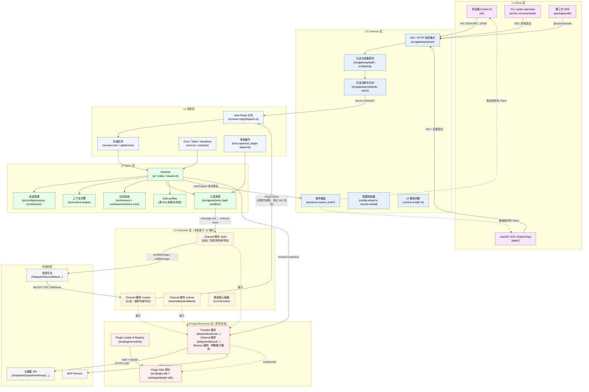
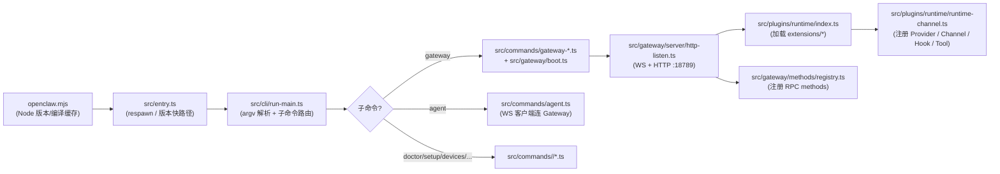
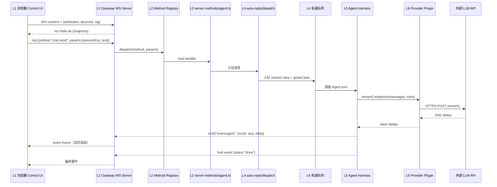
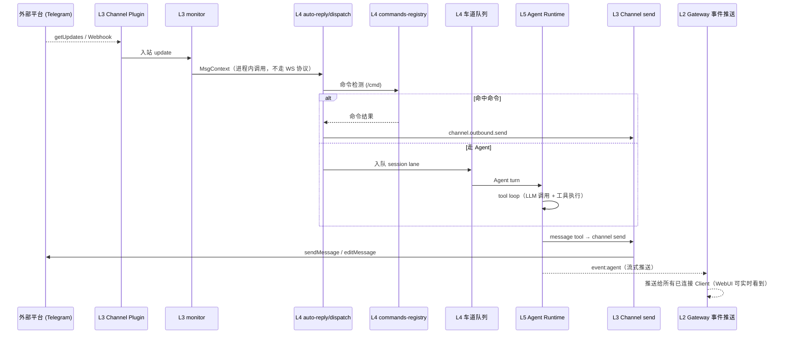
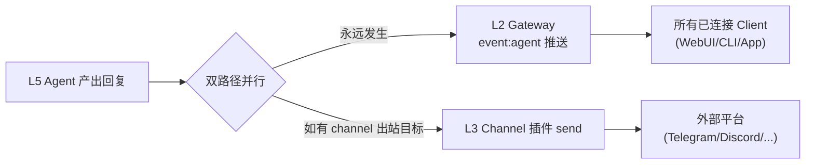
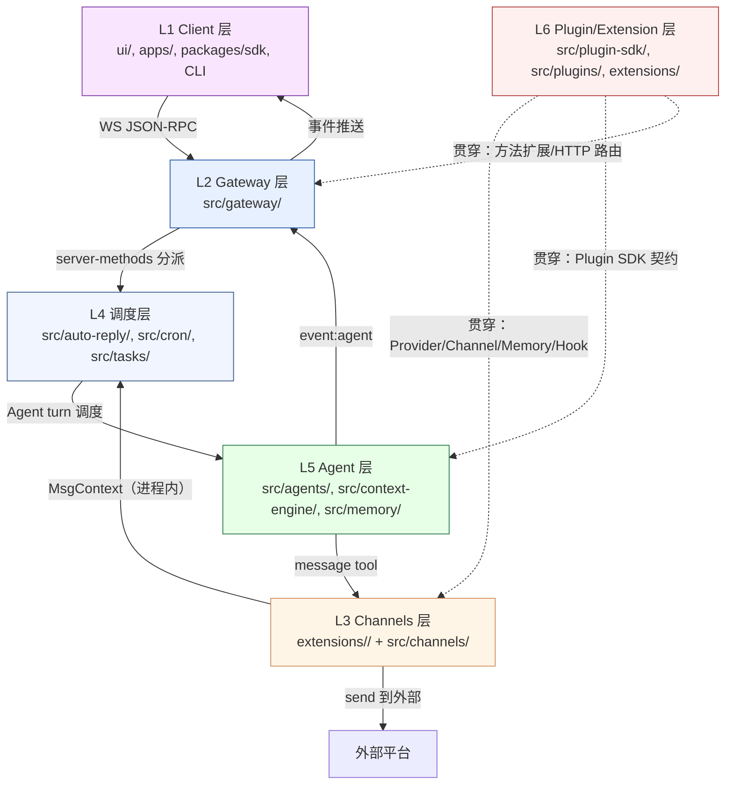
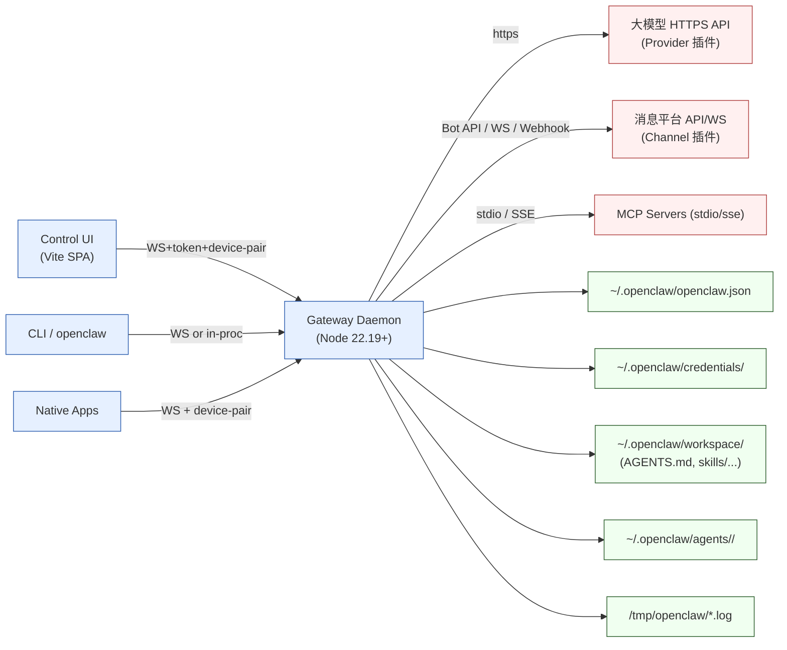
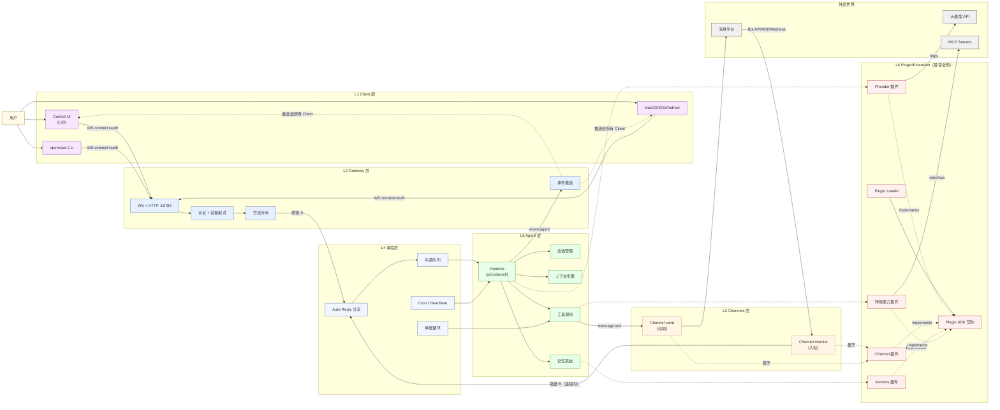

# OpenClaw 系统架构梳理报告

> 分析对象：`/root/autodl-tmp/OpenClaw/My-OpenClaw`
> 分析维度：模块划分 / 系统集成 / 依赖关系 / 架构层次
> 文档版本：v2.0（基于仓库 `2026.5.21` 版本快照，六层架构模型）

---

## 0. 报告摘要（TL;DR）

OpenClaw 是一个 **以单进程 Gateway 为核心的多通道个人 AI 助手平台**。系统采用 **六层架构**：

| 层级                       | 名称           | 一句话职责                                                                                   |
| -------------------------- | -------------- | -------------------------------------------------------------------------------------------- |
| **L1 Client 层**           | 客户端接入     | WebUI / CLI / 移动端通过统一 WS JSON-RPC 协议连入 Gateway                                    |
| **L2 Gateway 层**          | 服务平面       | 协议端点、认证配对、方法分派、事件推送、配置热加载、UI 托管                                  |
| **L3 Channels 层**         | 消息渠道接入   | 监听外部平台（Telegram/Discord/WhatsApp/…），将平台消息标准化为 `MsgContext`，直接传入调度层 |
| **L4 调度层**              | 编排与分流     | auto-reply 分流（命令 vs Agent）、车道队列、Cron/Tasks/Heartbeat、审批循环                   |
| **L5 Agent 层**            | 智能体内核     | Harness（pi/codex/claude-cli）、会话管理、上下文引擎、记忆系统、工具调用                     |
| **L6 Plugin/Extension 层** | 插件契约与实现 | Plugin SDK 契约 + 135 个扩展（Provider/Channel/Memory/Browser/MCP/…），贯穿 L1–L5            |

**两条并行的数据入站路径**：

```
路径 A（Client 发起）：  WebUI/CLI/App → L1 Client → L2 Gateway → L4 调度 → L5 Agent
路径 B（Channel 入站）：  外部平台 → L3 Channels → L4 调度 → L5 Agent

回复方向：
  Agent 产出回复
    ├─→ Gateway event:agent 推送给所有已连接 Client（永远发生）
    └─→ Channel 插件 send 发回外部平台（如有 channel 出站目标）

L6 Plugin/Extension 层 贯穿上述所有层级
```

---

## 1. 顶层目录结构与角色

```
My-OpenClaw/
├── src/                  # 【Gateway 后端核心】Node.js + TypeScript（104 顶层条目）
│   ├── entry.ts          # CLI 启动入口（编译缓存、respawn、版本快路径）
│   ├── library.ts        # Library 模式公共导出
│   ├── runtime.ts        # 运行时 I/O 抽象（log/error/exit/stdout）
│   ├── cli/              # 命令行解析与子命令调度
│   ├── commands/         # 各 CLI 命令实现（gateway/agent/setup/doctor/...）
│   ├── gateway/          # 【L2 Gateway 层】WS + HTTP 服务（494 文件）
│   │   ├── protocol/     # 协议契约（TypeBox + JSON Schema）
│   │   ├── server/       # WS/HTTP 服务器、连接、握手
│   │   ├── server-methods/ # 全部 RPC method 处理器
│   │   ├── methods/      # 方法描述符注册表（scope/owner/startup）
│   │   └── ...           # auth / config-reload / push / control-ui-http
│   ├── agents/           # 【L5 Agent 层】运行时（492 文件）harness / tools / auth-profiles
│   ├── auto-reply/       # 【L4 调度层】自动回复、命令检测、分发管线
│   ├── channels/         # 【L3 渠道核心抽象】（与 extensions/<channel> 配合）
│   ├── plugins/          # 【L6 Plugin】插件加载、激活、注册、运行时（491 文件）
│   ├── plugin-sdk/       # 【L6 Plugin SDK】公共契约实现源（~500 个子路径）
│   ├── mcp/              # MCP（Model Context Protocol）网关与 stdio 服务器
│   ├── memory/           # 记忆系统核心契约
│   ├── tasks/            # 任务（Run/Task）调度
│   ├── tools/            # 工具编排（与 agents/tools 区分）
│   ├── cron/             # 【L4 调度层】定时调度 / Heartbeat
│   ├── tts/, talk/       # 语音合成 / 实时语音
│   ├── secrets/, security/ # 凭据管理与审计
│   ├── pairing/, daemon/ # 设备配对、守护进程模式
│   └── config/           # 配置 schema / 加载 / 迁移 / 备份
├── ui/                   # 【L1 Client 层·WebUI】Vite 8 + Lit 3（127 个 ui 模块）
│   ├── src/main.ts       # 入口，注册 ServiceWorker
│   ├── src/ui/app.ts     # 顶层 Lit 应用根组件
│   ├── src/ui/gateway.ts # GatewayBrowserClient（WS RPC + 设备签名）
│   ├── src/ui/controllers/ # 按业务模块拆分的状态控制器
│   ├── src/ui/chat/      # 聊天 UI（消息渲染、工具卡、Talk 实时音频）
│   └── src/ui/components/ # 通用 Lit Web Components
├── extensions/           # 【L6 扩展实现】135 个独立子包，pnpm workspace
│   ├── deepseek/, openai/, anthropic/, google/, ...   # Provider 插件
│   ├── telegram/, discord/, whatsapp/, slack/, ...    # Channel 插件（L3 的具体实现）
│   ├── memory-core/, memory-lancedb/, active-memory/  # 记忆/知识插件
│   ├── browser/, codex/, opencode/, mcp/, canvas/     # 复合能力插件
│   └── *each*/openclaw.plugin.json                    # 插件声明清单
├── packages/             # 内部 workspace 包
│   ├── sdk/              # @openclaw/sdk 外部消费 SDK（L1 Client 层）
│   ├── plugin-sdk/       # @openclaw/plugin-sdk（exports map → src/plugin-sdk/*）
│   ├── plugin-package-contract/  # 插件包契约
│   └── memory-host-sdk/  # 记忆引擎宿主 SDK
├── apps/                 # 【L1 Client 层·移动端/桌面端】原生 App
│   ├── android/ ios/ macos/ swabble/ shared/ macos-mlx-tts/
├── docs/                 # 文档（plugins/concepts/gateway/cli/...）
├── scripts/              # 构建、检查、签名、benchmark 工具脚本
├── openclaw.mjs          # 顶层 CLI 入口（启动器：Node 版本/编译缓存/respawn）
├── package.json          # 根 + scripts + workspace
├── pnpm-workspace.yaml   # workspace 拓扑
├── tsdown.config.ts      # 后端打包配置
└── docker-compose.yml    # 容器编排
```

---

## 2. 六层架构分析

### 2.1 六层架构全景图



### 2.2 各层详细分析

#### L1 Client 层

**职责**：用户操作入口，通过统一的 WS JSON-RPC 协议直接构造 Gateway 协议帧连入 Gateway。

| 子模块                 | 代码位置                                   | 核心文件                                                                                        | 说明                                                                                         |
| ---------------------- | ------------------------------------------ | ----------------------------------------------------------------------------------------------- | -------------------------------------------------------------------------------------------- |
| **Control UI (WebUI)** | `ui/`                                      | `ui/src/main.ts`、`ui/src/ui/app.ts`、`ui/src/ui/gateway.ts`                                    | Vite 8 + Lit 3 SPA；`GatewayBrowserClient` 直接 import `src/gateway/protocol/*` 保持协议同源 |
| **UI Controllers**     | `ui/src/ui/controllers/`                   | `chat.ts`、`channels.ts`、`agents.ts`、`devices.ts`、`exec-approval.ts`、`config.ts`、`logs.ts` | 各业务视图状态控制器（订阅 Gateway 事件 + 触发 RPC）                                         |
| **UI Chat**            | `ui/src/ui/chat/`                          | `tool-cards.ts`、`run-lifecycle.ts`、`realtime-talk-*.ts`、`slash-commands.ts`                  | 聊天 UI（流式 token 渲染、工具卡、Talk WebRTC/PCM 实时音频）                                 |
| **CLI**                | `openclaw.mjs`、`src/entry.ts`、`src/cli/` | `openclaw.mjs`、`src/entry.ts`、`src/cli/run-main.ts`、`src/cli/program/subcli-descriptors.ts`  | Node 版本检查、编译缓存、argv 解析、子命令路由                                               |
| **CLI 命令**           | `src/commands/`                            | `commands/agent.ts`、`commands/gateway-status.ts`、`commands/setup/*`、`commands/doctor/*`      | `openclaw <cmd>` 行为实现                                                                    |
| **原生 App**           | `apps/`                                    | `apps/macos`、`apps/ios`、`apps/android`、`apps/swabble`                                        | 通过 WS Gateway 协议接入；Swift 模型由协议 JSON Schema 生成                                  |
| **外部 SDK**           | `packages/sdk/`                            | `client.ts`、`event-hub.ts`、`transport.ts`、`types.ts`                                         | `@openclaw/sdk`：外部 Node/TS 程序调用 Gateway 的客户端库                                    |

> **关键特征**：所有 Client 都构造原生 WS 协议帧（`{type:"req", method, params}`），不存在"格式转换"——Client 本来就说 Gateway 的语言。

---

#### L2 Gateway 层

**职责**：唯一的控制平面入口，单进程 Node.js 守护进程，承载 WS/HTTP 端点与全局服务治理。

| 子模块             | 代码位置                                         | 核心文件                                                                     | 说明                                                                                        |
| ------------------ | ------------------------------------------------ | ---------------------------------------------------------------------------- | ------------------------------------------------------------------------------------------- |
| **协议端点**       | `src/gateway/server/`                            | `ws-connection/message-handler.ts`、`http-listen.ts`、`readiness.ts`         | WS + HTTP 端口监听(:18789)、握手、连接生命周期                                              |
| **协议契约**       | `src/gateway/protocol/`                          | `schema.ts`、`schema/*.ts`、`version.ts`                                     | TypeBox 定义全部 WS RPC 请求/响应/事件 Schema；运行时 Ajv 校验                              |
| **认证与配对**     | `src/gateway/auth*.ts`、`src/pairing/`           | `auth.ts`、`auth-mode-policy.ts`、`auth-rate-limit.ts`、`device-auth.ts`     | 三种模式（none/token/password）+ 设备配对（签名 nonce + device-token）                      |
| **方法注册与分派** | `src/gateway/methods/`                           | `descriptor.ts`、`core-descriptors.ts`、`registry.ts`、`call.ts`             | 中央方法注册表（scope/owner/startup/controlPlaneWrite）+ 分派                               |
| **方法实现**       | `src/gateway/server-methods/`                    | `agent.ts`、`channels.ts`、`config.ts`、`artifacts.ts`、`approval-shared.ts` | 每个 RPC 方法处理器（`agents.list`、`channels.start`、`config.apply`、`talk.session.*` 等） |
| **事件推送**       | `src/gateway/server/presence-events.ts`、`push*` | `presence-events.ts`、`server-broadcast.ts`                                  | 服务端 → Client 事件流（`agent`/`chat`/`presence`/`health`/`cron`）                         |
| **配置热加载**     | `src/gateway/config-reload.ts`                   | `config-reload.ts`、`config-reload-plan.ts`                                  | 在线切配置/凭据无需重启                                                                     |
| **UI 静态托管**    | `src/gateway/control-ui-http*.ts`                | `control-ui-http-utils.ts`                                                   | 在 `/__openclaw__/` 路径下托管 Control UI 构建产物                                          |

> **关键特征**：Gateway 是整个系统唯一的长驻进程。全部 Client 走 WS，全部 Channel 在同一进程内运行。WS 协议使用 TypeBox Schema 作为 Single Source of Truth，同时生成 TS 类型、JSON Schema 和 Swift 模型。

---

#### L3 Channels 层

**职责**：监听外部消息平台，将平台原始消息标准化为 `MsgContext`，在 Gateway 进程内直接传入 L4 调度层（**不经过 WS 协议层**）。

**本质**：Channels 是 L6 Plugin/Extension 层的一种特化，每个 Channel 就是一个 `extensions/<channel>/` 插件，通过 `defineBundledChannelEntry` 注册。

| 子模块               | 代码位置                                      | 核心文件                                                                                                                      | 说明                                                                                           |
| -------------------- | --------------------------------------------- | ----------------------------------------------------------------------------------------------------------------------------- | ---------------------------------------------------------------------------------------------- |
| **入站 monitor**     | `extensions/<channel>/runtime-api.monitor.ts` | 各渠道实现                                                                                                                    | 监听外部平台（long-polling/WebSocket/Webhook）→ 构建 `MsgContext` → 传入 `auto-reply/dispatch` |
| **出站 send**        | `extensions/<channel>/runtime-api.send.ts`    | 各渠道实现                                                                                                                    | Agent 回复通过 message tool → 调用 channel send → 发送到外部平台                               |
| **动作 actions**     | `extensions/<channel>/runtime-api.actions.ts` | 各渠道实现                                                                                                                    | react、edit、poll、callback 等平台特有操作                                                     |
| **渠道核心抽象**     | `src/channels/`                               | `channel-config.ts`、`bundled-channel-catalog-read.ts`、`command-gating.ts`、`allowlists/`、`conversation-binding-context.ts` | Core 侧渠道抽象、白名单、命令开关、target/thread 绑定解析                                      |
| **Channel 插件入口** | `extensions/<channel>/index.ts`               | `openclaw.plugin.json`、`channel-plugin-api.ts`、`setup-entry.ts`                                                             | 插件声明清单 + channel plugin 契约 + 账户设置                                                  |

> **关键特征**：Channel 入站消息 **不走 Gateway WS 协议**，而是在 Gateway 进程内部直接调用 `src/auto-reply/dispatch.ts`。这是与 Client 路径最本质的区别。

支持的消息平台示例：

| 平台     | 插件 ID    | 接入方式                       |
| -------- | ---------- | ------------------------------ |
| Telegram | `telegram` | Bot API long-polling（grammY） |
| Discord  | `discord`  | WebSocket（Carbon）            |
| WhatsApp | `whatsapp` | WebSocket（Baileys）           |
| Slack    | `slack`    | Events API / Socket Mode       |
| Signal   | `signal`   | signal-cli bridge              |
| iMessage | `imessage` | AppleScript bridge             |
| Matrix   | `matrix`   | Matrix client SDK              |
| 飞书     | `feishu`   | 飞书 Bot API                   |
| 企业微信 | `msteams`  | Teams Bot Framework            |

---

#### L4 调度层

**职责**：两条入站路径（Client / Channel）在此汇合，负责分流、排队、定时任务与审批。

| 子模块              | 代码位置                                                                                    | 核心文件                                                                                | 说明                                                                                                              |
| ------------------- | ------------------------------------------------------------------------------------------- | --------------------------------------------------------------------------------------- | ----------------------------------------------------------------------------------------------------------------- |
| **Auto-Reply 分流** | `src/auto-reply/`                                                                           | `dispatch.ts`、`dispatch-dispatcher.ts`、`command-detection.ts`、`commands-registry.ts` | 入站消息分流：命令（`/cmd`） vs Agent turn vs 直接回复                                                            |
| **车道队列**        | `src/auto-reply/` + Agent 运行时                                                            | `runEmbeddedPiAgent`（per-session lane + global lane）                                  | Lane-aware FIFO（session:`<key>` lane + global `main`/`subagent` lane），默认 main 并发 4、subagent 并发 8        |
| **队列模式**        | `src/auto-reply/`                                                                           | `dispatch.ts`、`envelope.ts`                                                            | `steer`（注入活跃 turn）/ `followup`（排队下一 turn）/ `collect`（合并后一次 turn）/ `interrupt`（中止当前 turn） |
| **Cron 定时调度**   | `src/cron/`                                                                                 | `delivery.ts`、`delivery-plan.ts`、`heartbeat-policy.ts`、`isolated-agent/`             | Agent 定时任务、Heartbeat 心跳投递                                                                                |
| **Tasks / Run**     | `src/tasks/`                                                                                | （配合 `gateway/server-methods/tasks.ts`）                                              | 长任务调度、状态查询、取消                                                                                        |
| **审批循环**        | `src/gateway/server-methods/approval-shared.ts`、`src/agents/bash-tools.exec-approval-*.ts` | `exec-approval`、`plugin-approval`                                                      | bash/工具执行的人机批准回路（黑白名单 + 日志）                                                                    |

> **关键特征**：调度层是两条入站路径（路径 A：Client → Gateway → 此处；路径 B：Channel → 此处）的汇合点。无论消息从 WebUI 还是 Telegram 来，最终都通过 `auto-reply/dispatch` 进入 Agent。

---

#### L5 Agent 层

**职责**：智能体执行内核——接收消息 → 加载会话与记忆 → 调用 LLM → 解析结果（文本+工具）→ 执行工具 → 流式回复 → 保存状态。

| 子模块                    | 代码位置                                         | 核心文件                                                                                                                 | 说明                                                                                             |
| ------------------------- | ------------------------------------------------ | ------------------------------------------------------------------------------------------------------------------------ | ------------------------------------------------------------------------------------------------ |
| **Harness（运行时选择）** | `src/agents/harness/`                            | `registry.ts`、`runtime-plugin.ts`、`selection.ts`、`builtin-pi.ts`                                                      | 多种 agent runtime：`pi`（内嵌）、`codex`（内嵌）、`claude-cli`（CLI backend）                   |
| **执行循环**              | `src/agents/`                                    | `agent-runtime.ts`、`pi-embedded.ts`（`runEmbeddedPiAgent`）                                                             | 入站 → 解析 model+auth → 构建 session → subscribe events → 流式 tool/assistant delta → 超时/中止 |
| **会话管理**              | `src/config/sessions/`、`src/sessions/`          | `store.ts`、`main-session.ts`、`session-id.ts`、`session-label.ts`                                                       | 会话元数据持久化、Session 映射、写锁保护                                                         |
| **上下文引擎**            | `src/context-engine/`                            | `delegate.ts`、`init.ts`、`registry.ts`、`types.ts`                                                                      | 组装上下文窗口、控制 token 数量、确保上下文连贯性                                                |
| **记忆系统**              | `src/memory/` + `extensions/memory-core/`        | `root-memory-files.ts`、`dreaming-*.ts`、`manager-runtime.ts`                                                            | 短时/长时记忆、Dreaming（后台合成叙事）、Memory 工具                                             |
| **工具调用**              | `src/agents/tools/`                              | `message-tool.ts`、`gateway-tool.ts`、`sessions-send-tool.ts`、`image-generate-tool.ts`、`nodes-tool.ts`、`cron-tool.ts` | 内建工具集合（消息发送/媒体生成/会话管理/节点远控/定时任务）                                     |
| **Bash 沙盒**             | `src/agents/bash-tools.exec*.ts`                 | `bash-tools.exec-runtime.ts`、`bash-tools.exec-approval-*.ts`                                                            | PTY / Docker 执行、security-floor、approval 审批                                                 |
| **Auth-profiles**         | `src/agents/auth-profiles/`                      | `auth-profiles.ts`、`auth-profiles.runtime.ts`                                                                           | 多 API Key 轮换、冷却策略、OAuth token 刷新                                                      |
| **Hook 系统**             | `src/hooks/`                                     | 内部 hook + 插件 hook                                                                                                    | `before_model_resolve`、`before_prompt_build`、`before_tool_call`、`agent_end` 等切点            |
| **系统 Prompt**           | `src/agents/system-prompt*.ts`、`bootstrap-*.ts` | `system-prompt.ts`、`bootstrap-prompt.ts`、`bootstrap-files.ts`                                                          | 从 workspace `AGENTS.md`/`SOUL.md`/`TOOLS.md` + skills + 上下文组装 system prompt                |

> **关键特征**：Agent 层不直接调用任何 LLM 厂商 API，而是通过 Harness 抽象和 L6 的 Provider 插件完成模型调用。这保持了 core 的 plugin-agnostic 特性。

**Agent 执行循环详细流程**（对应 `docs/concepts/agent-loop.md`）：

```
1. agent RPC 校验参数、解析 session → 返回 {runId, acceptedAt}
2. agentCommand: 解析 model + thinking defaults → 加载 skills → 调用 runEmbeddedPiAgent
3. runEmbeddedPiAgent: per-session + global 队列串行化 → 解析 model + auth → 构建 pi session
4. subscribeEmbeddedPiSession: 桥接 pi-agent-core 事件到 OpenClaw agent stream
   - tool events  → stream:"tool"
   - assistant deltas → stream:"assistant"
   - lifecycle events → stream:"lifecycle" (start/end/error)
5. 工具调用 → 沙盒执行 → 审批(如需) → 结果回传
6. 最终回复组装 → event:agent 推送 + channel send(如有)
```

---

#### L6 Plugin/Extension 层

**职责**：提供统一的插件契约（Plugin SDK）与具体实现。L3 Channels 层的实现、L5 Agent 层的 Provider/Memory 实现都是此层的具体插件。此层**贯穿 L1–L5 各层**。

| 子模块               | 代码位置                                               | 核心文件                                                                                                         | 说明                                                                |
| -------------------- | ------------------------------------------------------ | ---------------------------------------------------------------------------------------------------------------- | ------------------------------------------------------------------- |
| **Plugin SDK 契约**  | `src/plugin-sdk/`、`packages/plugin-sdk/`              | `entrypoints.ts`、`plugin-entry.ts`、`provider-entry.ts`、`channel-contract.ts`、`api-baseline.ts`               | 对外公开 ~500 个子路径（`openclaw/plugin-sdk/<subpath>`）           |
| **Plugin Loader**    | `src/plugins/`                                         | `runtime/index.ts`、`runtime/load-context.ts`、`runtime/runtime-channel.ts`、`activation-planner.ts`、`types.ts` | 清单发现 → 激活规划 → 运行时注册（Provider/Channel/Hook/Tool/...）  |
| **清单（Manifest）** | `extensions/<id>/openclaw.plugin.json`                 | 每插件 manifest                                                                                                  | 描述能力、激活策略、模型目录、配置 schema、auth、env vars、UI hints |
| **插件类型**         | `src/plugins/types.ts`、`src/plugins/runtime/types.ts` |                                                                                                                  | 全部 `OpenClawPluginApi` 类型                                       |
| **包契约**           | `packages/plugin-package-contract/`                    | `src/*.ts`                                                                                                       | 插件 `package.json`/manifest 校验                                   |
| **记忆宿主 SDK**     | `packages/memory-host-sdk/`                            | `src/*.ts`                                                                                                       | 给 `memory-*` 系列插件的宿主 SDK                                    |

**能力注册（Capability Registration）**——插件的主要接入方式：

| 能力类型             | 注册 API                                        | 典型插件                                        |
| -------------------- | ----------------------------------------------- | ----------------------------------------------- |
| 文本推理 / Provider  | `api.registerProvider(...)`                     | `openai`、`anthropic`、`deepseek`、`google`     |
| CLI 推理后端         | `api.registerCliBackend(...)`                   | `anthropic`(claude-cli)、`codex`、`kimi-coding` |
| 嵌入                 | `api.registerEmbeddingProvider(...)`            | provider-owned vector plugins                   |
| TTS / Realtime Voice | `api.registerSpeechProvider(...)` 等            | `elevenlabs`、`openai`、`microsoft`             |
| 媒体理解             | `api.registerMediaUnderstandingProvider(...)`   | `openai`、`google`、`anthropic`                 |
| 图像/音乐/视频生成   | `register{Image,Music,Video}GenerationProvider` | `openai`、`fal`、`minimax`、`runway`            |
| Web 检索/抓取        | `register{WebFetch,WebSearch}Provider`          | `firecrawl`、`google`、`brave`、`tavily`        |
| 渠道/消息平台        | `api.registerChannel(...)`                      | `telegram`、`discord`、`whatsapp`、`slack`      |
| 服务发现             | `api.registerGatewayDiscoveryService(...)`      | `bonjour`                                       |
| Hook                 | `api.registerHook(...)` / Hook map              | `before_model_resolve`、`before_prompt_build`   |

**Manifest-first 原则**：Gateway 启动期先从 `openclaw.plugin.json` 构建 `PluginMetadataSnapshot`（仅 metadata，无运行时代码），用于渠道归属、Provider 归属、配置校验、auto-enable 决策。运行时代码仅在实际需要时加载。

---

### 2.3 控制流与数据流

#### 2.3.1 启动控制流



#### 2.3.2 路径 A：Client 发起的对话（WebUI → Gateway → Agent）



#### 2.3.3 路径 B：Channel 入站消息（Telegram → Channel → Agent）



#### 2.3.4 回复路径（Agent 产出后的双路径并行）



> **关键区别**：即使消息从 Telegram 入站，Control UI 上也能实时看到 Agent 处理过程，因为 Agent 事件会同时通过 Gateway 推送给所有已连接的 Client。

---

## 3. 系统集成分析

### 3.1 前后端架构与交互方式

**通信协议**：Gateway 是唯一控制平面入口，全部 Client 走统一 WebSocket 通道（默认 `127.0.0.1:18789`）。

| 维度          | 实现                                                                                                      |
| ------------- | --------------------------------------------------------------------------------------------------------- |
| **传输**      | WebSocket 文本帧 + JSON 载荷；少量 HTTP 路由用于静态托管 Control UI、MCP HTTP、嵌入式 HTTP                |
| **请求/响应** | `{type:"req", id, method, params}` → `{type:"res", id, ok, payload\|error}`                               |
| **事件推送**  | `{type:"event", event, payload, seq, stateVersion}`；事件无重放，客户端断线需自行 refresh                 |
| **首帧**      | 必须是 `connect`，否则硬关；返回 `hello-ok` 包含 features / presence / health 快照                        |
| **协议契约**  | TypeBox schema → 编译期 TS 类型 + 运行时 Ajv JSON Schema 校验；Swift 模型由 JSON Schema 生成              |
| **认证**      | 三种模式：`none`（本地开发）/ `token`（推荐）/ `password`；外加设备配对（签名 `connect.challenge` nonce） |
| **协议版本**  | `PROTOCOL_VERSION` 与 `MIN_CLIENT_PROTOCOL_VERSION` 握手协商                                              |

**两条入站路径的关键区别**：

| 维度              | 路径 A（Client）                              | 路径 B（Channel）                              |
| ----------------- | --------------------------------------------- | ---------------------------------------------- |
| 发起方            | 用户在 WebUI/CLI/App 操作                     | 外部平台消息到达                               |
| 协议              | WS JSON-RPC 帧                                | 各平台 Bot API/WS/Webhook                      |
| 进入 Gateway 方式 | 走 WS 握手 + 认证 + 方法分派                  | Gateway 进程内 monitor 直接调用                |
| 到达调度层的格式  | server-methods 处理后传入                     | `MsgContext`（`src/auto-reply/templating.ts`） |
| 身份认证          | operator scope（`operator.read/write/admin`） | 不参与 operator scope                          |

### 3.2 外部服务依赖与接口定义

| 类别             | 外部依赖                                                                                   | 接入位置                                              | 接口定义 / 入口                                                                                                           |
| ---------------- | ------------------------------------------------------------------------------------------ | ----------------------------------------------------- | ------------------------------------------------------------------------------------------------------------------------- |
| **大模型 API**   | DeepSeek, OpenAI, Anthropic, Google, Cerebras, Groq, MiniMax, Qwen, Moonshot, …            | `extensions/<provider>/`                              | `index.ts` → `definePluginEntry` / `defineSingleProviderPluginEntry`；模型清单在 `openclaw.plugin.json` 的 `modelCatalog` |
| **消息平台**     | Telegram, Discord, WhatsApp, Slack, Signal, iMessage, Matrix, Mattermost, Teams, Feishu, … | `extensions/<channel>/`                               | `index.ts` → `defineBundledChannelEntry`；`channel-plugin-api.ts` + `runtime-api.{send,monitor,actions}.ts`               |
| **MCP 服务器**   | 任意 MCP-compliant 工具服务器                                                              | `src/mcp/`、`extensions/mcp/`                         | `tools-stdio-server.ts`（stdio）、`mcp-http.ts`（HTTP/SSE）                                                               |
| **媒体生成**     | image/music/video/tts 各厂商                                                               | `extensions/*`                                        | `api.register{Image,Music,Video}GenerationProvider` / `registerSpeechProvider`                                            |
| **记忆存储**     | LanceDB、本地文件                                                                          | `extensions/memory-lancedb`、`extensions/memory-core` | `memory-host-sdk` + `openclaw/plugin-sdk/memory-*`                                                                        |
| **浏览器自动化** | 嵌入式 Chrome / CDP                                                                        | `extensions/browser`                                  | `openclaw/plugin-sdk/browser-cdp`、`browser-node-host`                                                                    |
| **CLI 外部进程** | Claude CLI、Codex CLI                                                                      | `extensions/codex`、`extensions/anthropic`            | `api.registerCliBackend(...)`                                                                                             |

> 核心约束（来自 `AGENTS.md`）：Core 保持 **plugin-agnostic**，不硬编码厂商身份；插件只通过 `openclaw/plugin-sdk/*` 子路径进入 core；core 不允许 deep import `extensions/*/src/**`。

### 3.3 外部服务集成方式

| 集成模式                      | 描述                         | 典型实现                                                               |
| ----------------------------- | ---------------------------- | ---------------------------------------------------------------------- |
| **HTTPS 流式（SSE/chunked）** | Provider 插件调用厂商 REST   | `extensions/deepseek/stream.ts`、`extensions/anthropic/cli-backend.ts` |
| **WebSocket 长连**            | Channel 插件持有消息平台 WS  | `extensions/whatsapp`（Baileys）、`extensions/discord`（Carbon）       |
| **HTTP Long-polling**         | Telegram getUpdates          | `extensions/telegram/src/bot/*`                                        |
| **OAuth / CLI 复用**          | 复用本机 CLI                 | `extensions/anthropic/cli-auth-seam.ts`、`extensions/codex`            |
| **Webhook 入站**              | 平台主动回调                 | `extensions/webhooks/`                                                 |
| **stdio / SSE (MCP)**         | MCP 客户端/服务器            | `src/mcp/tools-stdio-server.ts`、`src/gateway/mcp-http.ts`             |
| **本地子进程 / 沙盒**         | Bash 工具执行（PTY、Docker） | `src/agents/bash-tools.exec*.ts`                                       |

---

## 4. 依赖关系梳理

### 4.1 六层间依赖关系



### 4.2 服务级依赖



### 4.3 核心依赖规则

出自 `AGENTS.md` 与各子目录 `AGENTS.md`：

- Core 不允许 deep import `extensions/*/src/**` 或 `onboard.js`
- Plugins 生产代码不允许 import core 的 `src/**`、`src/plugin-sdk-internal/**`、其它 plugin 的 `src/**`
- Plugins 只可通过 `openclaw/plugin-sdk/*` 公共子路径、本地 `api.ts`/`runtime-api.ts` 桶进入核心
- Channel core `src/channels/**` 是核心实现；Plugin 作者只能使用 SDK seam（`channel-contract.ts`、`channel-entry-contract.ts`）
- `import cycle` 用 `pnpm check:import-cycles` 持续守护
- Plugin SDK 接口由 `api-baseline.ts` + `scripts/lib/plugin-sdk-entrypoints.json` 锁定

### 4.4 关键接口定义文件清单

| 类别                | 文件                                                                                                      | 描述                                                                                                                                 |
| ------------------- | --------------------------------------------------------------------------------------------------------- | ------------------------------------------------------------------------------------------------------------------------------------ |
| **WS 协议契约**     | `src/gateway/protocol/schema.ts`、`schema/*.ts`                                                           | TypeBox schema（agent/sessions/channels/tasks/exec-approvals/cron/secrets/devices/wizard/plugins/artifacts/config/commands/push 等） |
| **协议版本**        | `src/gateway/protocol/version.ts`                                                                         | `PROTOCOL_VERSION`, `MIN_CLIENT_PROTOCOL_VERSION`                                                                                    |
| **Method 注册**     | `src/gateway/methods/descriptor.ts`、`core-descriptors.ts`、`registry.ts`                                 | 全部 RPC 方法 + scope/owner/startup/controlPlaneWrite                                                                                |
| **Plugin SDK 入口** | `src/plugin-sdk/entrypoints.ts`、`packages/plugin-sdk/package.json`                                       | 公共子路径列表                                                                                                                       |
| **Plugin 注册 API** | `src/plugin-sdk/plugin-entry.ts`、`provider-entry.ts`、`channel-contract.ts`、`channel-entry-contract.ts` | 插件入口契约                                                                                                                         |
| **Plugin 类型**     | `src/plugins/types.ts`、`src/plugins/runtime/types.ts`                                                    | `OpenClawPluginApi` 全部类型                                                                                                         |
| **Channel 类型**    | `src/channels/plugins/types.{plugin,core,adapters,public}.ts`                                             | Channel 抽象（plugin/core/adapter/public）                                                                                           |
| **Plugin 清单**     | `extensions/<id>/openclaw.plugin.json` + `src/plugins/manifest-types.ts`                                  | 每插件清单 + 全局 schema                                                                                                             |
| **配置 schema**     | `src/config/types.openclaw.ts`、`src/config/types.models.ts`                                              | `~/.openclaw/openclaw.json` 全部字段                                                                                                 |
| **外部 SDK**        | `packages/sdk/src/types.ts`、`client.ts`                                                                  | `@openclaw/sdk` 外部消费接口                                                                                                         |
| **UI ↔ Gateway**    | `ui/src/ui/gateway.ts`                                                                                    | 浏览器 WS 客户端（import `src/gateway/protocol/*` 类型）                                                                             |
| **记忆 SDK**        | `packages/memory-host-sdk/src/*.ts`                                                                       | 记忆引擎宿主契约                                                                                                                     |

---

## 5. 架构层次与设计模式

### 5.1 六层层次图

```
┌──────────────────────────────────────────────────────────────┐
│  L1 Client 层                                                │
│    WebUI (Lit3) · CLI · macOS/iOS/Android App · SDK          │
│    ──→ 统一 WS JSON-RPC 协议帧连入 Gateway                   │
└──────────────────────────────────────────────────────────────┘
         │ WS :18789                          ▲ event:agent 推送
         ▼                                    │
┌──────────────────────────────────────────────────────────────┐
│  L2 Gateway 层                                                │
│    ① 协议端点(WS+HTTP)  ② 认证+配对  ③ 方法注册分派          │
│    ④ 事件推送           ⑤ 配置热加载  ⑥ UI 静态托管           │
└──────────────────────────────────────────────────────────────┘
         │ server-methods 分派                ▲ event:agent
         ▼                                    │
┌──────────────────────────┐  MsgContext  ┌───┴──────────────┐
│  L3 Channels 层           │────────────→│  L4 调度层         │
│  (本质属于 L6 插件)        │  进程内调用   │                   │
│  monitor/send/actions     │             │  auto-reply 分流  │
│  src/channels/ 核心抽象    │             │  车道队列          │
│  extensions/<channel>/    │             │  Cron/Heartbeat   │
│                           │             │  审批循环          │
│      ▲                    │             └───────────────────┘
│      │ channel send       │                       │
│      │                    │                       ▼
│  外部平台                  │             ┌───────────────────┐
│  (Telegram/Discord/...)   │             │  L5 Agent 层       │
└──────────────────────────┘             │  Harness · 会话    │
                                          │  上下文 · 记忆     │
                                          │  工具调用 · Auth   │
                                          └───────────────────┘
                                                    │
┌──────────────────────────────────────────────────────────────┐
│  L6 Plugin/Extension 层（贯穿 L1–L5）                         │
│    Plugin SDK 契约 (src/plugin-sdk/ + packages/plugin-sdk)   │
│    Plugin Loader (src/plugins/runtime/)                      │
│    135 个扩展: Provider / Channel / Memory / Browser / MCP   │
└──────────────────────────────────────────────────────────────┘
```

**依赖方向**：

- L1 只识 L2 的 wire 协议（WS JSON-RPC）
- L2 通过方法描述符分派到 L4
- L3 通过 `MsgContext` 进程内调用进入 L4
- L4 调度 Agent turn 到 L5
- L5 通过 L6 Plugin SDK 反向调用 Provider/Memory 等实现
- L6 不能 deep import L2/L5 之外的任何文件（由 `AGENTS.md` 与 boundary 测试守护）

### 5.2 关键设计模式

| 模式                               | 体现位置                                                        | 说明                                                         |
| ---------------------------------- | --------------------------------------------------------------- | ------------------------------------------------------------ |
| **Plugin / Capability Registry**   | `src/plugins/runtime/*`、`api.registerXxx` 系列                 | 中央能力注册中心；插件注册 capability，core 通过统一接口消费 |
| **Manifest-first Discovery**       | `openclaw.plugin.json` + `PluginMetadataSnapshot`               | 清单驱动；启动期不加载 runtime 代码即可完成 setup/校验       |
| **Versioned WS RPC + Server-Push** | `src/gateway/protocol/version.ts`、`call.ts`、`push*`           | 一连接双向：Client req/res + Server event 流                 |
| **Domain Method Registry**         | `src/gateway/methods/{descriptor,registry,core-descriptors}.ts` | 每方法标注 scope/owner/startup/controlPlaneWrite             |
| **Strategy + Adapter**             | `extensions/<id>/runtime-api.ts`、`channel-plugin-api.ts`       | 同一抽象 N 种厂商实现；core 只感知抽象                       |
| **Schema-as-source-of-truth**      | TypeBox → TS 类型 + JSON Schema + Swift Codegen                 | 跨语言一致性                                                 |
| **Hexagonal / Ports-and-Adapters** | `src/channels/plugins/types.{core,plugin,adapter}.ts`           | 内核定义 port，插件提供 adapter                              |
| **Lazy / Light vs Heavy**          | `*.runtime.ts`、`api.ts` 双轨                                   | 热路径 only metadata；执行路径才加载 runtime                 |
| **Observer / Event Bus**           | `packages/sdk/src/event-hub.ts`、`presence-events.ts`           | Client 订阅 `agent`/`presence`/`tick` 等事件                 |
| **Sandbox / Approval Loop**        | `agents/bash-tools.exec-approval-*.ts`                          | bash/工具的人机批准回路（黑白名单 + 日志）                   |
| **Idempotency Key**                | 协议规定 `idempotencyKey`（`send`/`agent`）                     | 网络重试去重                                                 |
| **Pairing + Device Trust**         | `src/pairing/`、`device-auth.ts`                                | 公私钥签名 nonce + 设备绑定 token                            |
| **Hot Reload**                     | `config-reload.ts`、`secrets.reload`                            | 在线切配置/凭据                                              |
| **Lane Queue**                     | `runEmbeddedPiAgent` 中的 session lane + global lane            | 防止同 session 并发竞争                                      |

### 5.3 扩展性与可维护性

**扩展性优势：**

1. **零侵入接入新厂商/平台**：新增 `extensions/<id>/`，写一个 `openclaw.plugin.json` + `index.ts` 即可。Provider 自带 modelCatalog + auth + onboarding 元数据。
2. **三类 Client 共享协议**：Browser/CLI/Native 走同一 WS schema；新 Client 只需实现 `connect` 握手。
3. **方法注册表**：新增功能 = 注册 `GatewayMethodDescriptor`，scope 即权限边界。
4. **能力分层**：Vendor 多能力（如 OpenAI 同时是 text + speech + image）通过一个插件聚合。
5. **静态 + 动态加载**：`*.runtime.ts` 懒加载减少启动开销。

**可维护性优势：**

1. **AGENTS.md 边界文件**：根目录及关键子目录都有规则文件。
2. **类型驱动协议**：TypeBox 改动 → TS/JSON-Schema/Swift 一致变化。
3. **严格的 import 边界**：`tsconfig.package-boundary.*.json` 阻断越界；`pnpm check:import-cycles` 守护。
4. **配置 strict 校验**：`~/.openclaw/openclaw.json` 顶层 `.strict()`，禁止未知键。
5. **可观测性**：日志按 subsystem 拆分；Prometheus/OTel 通过插件接入。

**潜在风险点：**

- 仓库巨大（`extensions/` 135 项，`src/` 数千文件），新人入门曲线陡峭
- 单 Gateway 全局唯一，宕机即失联——通过 launchd/systemd + `doctor` 缓解
- 协议演进需保持 additive，破坏式变化须显式 bump version
- 凭据安全：core 严禁打印 secret；secrets 文件分目录隔离

---

## 6. 端到端全景图



---

## 7. 总结与建议

### 7.1 关键设计要点

1. **单 Gateway + 统一 WS 协议**：所有 Client 连同一个进程，全局状态集中编排。
2. **两条并行入站路径**：Client 走 WS 协议；Channel 在进程内直接传入调度层。两条路径在 L4 调度层汇合。
3. **回复双路径并行**：Agent 事件永远推送给 Client + 同时通过 Channel send 回外部平台。
4. **Plugin 是第一性公民**：Core 保持 plugin-agnostic，几乎所有业务能力（Provider/Channel/Memory/...）都是 L6 插件。
5. **Schema 驱动**：TypeBox schema 是全系统协议的 Single Source of Truth。
6. **Manifest + Runtime 二分**：清单（metadata）和运行时（代码）分离，启动期轻量快速。
7. **明确的边界守护**：每个关键目录的 `AGENTS.md` + import cycle 检查 + boundary test。

### 7.2 二次开发推荐切入路径

| 目标              | 所属层级 | 切入位置                                   | 关键文件                                                                                 |
| ----------------- | -------- | ------------------------------------------ | ---------------------------------------------------------------------------------------- |
| 接入新模型厂商    | L6       | `extensions/<id>/`（参考 `deepseek`）      | `openclaw.plugin.json`、`index.ts`、`provider-discovery.ts`、`stream.ts`                 |
| 接入新消息渠道    | L3 + L6  | `extensions/<id>/`（参考 `telegram`）      | `openclaw.plugin.json`、`channel-plugin-api.ts`、`runtime-api.{send,monitor,actions}.ts` |
| 新增 Agent 工具   | L5       | `src/agents/tools/`                        | 参考 `message-tool.ts`、`session-status-tool.ts`                                         |
| 新增 WS RPC 方法  | L2       | 三件套                                     | `protocol/schema/` + `methods/core-descriptors.ts` + `server-methods/`                   |
| Control UI 新视图 | L1       | `ui/src/ui/controllers/` + `app-render.ts` | 控制器 + 视图模板 + tab 注册                                                             |
| 修改调度策略      | L4       | `src/auto-reply/dispatch.ts`、`src/cron/`  | 分流逻辑、队列模式                                                                       |
| 新增配置字段      | L2       | `src/config/types.openclaw.ts`             | strict schema + migration                                                                |
| Hook / 生命周期   | L6       | `src/hooks/` + `extensions/<id>/` 注册     | `before_model_resolve`、`before_prompt_build` 等                                         |
| MCP 工具集成      | L5 + L6  | `extensions/mcp/` 或 `src/mcp/`            | `tools-stdio-server.ts` 参考                                                             |

### 7.3 阅读路径推荐

1. **快速感性认知**：`README.md` → `docs/concepts/architecture.md` → `docs/plugins/architecture.md`
2. **L2 协议与服务**：`src/gateway/protocol/schema.ts` → `methods/core-descriptors.ts` → `server-methods/agent.ts`
3. **L4 调度**：`src/auto-reply/dispatch.ts` → `docs/concepts/queue.md`
4. **L5 Agent 执行链**：`docs/concepts/agent-loop.md` → `src/agents/pi-embedded.ts` → `src/agents/harness/registry.ts` → `src/agents/tools/message-tool.ts`
5. **L6 插件生命周期**：`src/plugins/runtime/load-context.ts` → `runtime-channel.ts` → `extensions/deepseek/index.ts`
6. **L1 前端**：`ui/src/main.ts` → `ui/src/ui/app.ts` → `ui/src/ui/gateway.ts` → `ui/src/ui/controllers/chat.ts`
7. **L1 CLI**：`openclaw.mjs` → `src/entry.ts` → `src/cli/run-main.ts`

---

> 本报告基于源码静态分析与项目内置 `AGENTS.md` / `docs/` 元规约综合得出；任何具体函数级行为请以源码与单元测试为最终参考。
